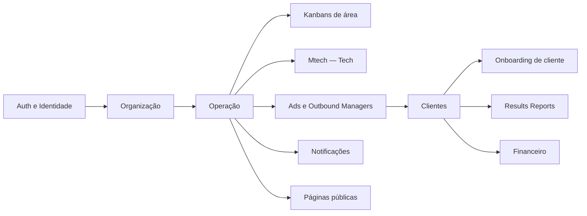
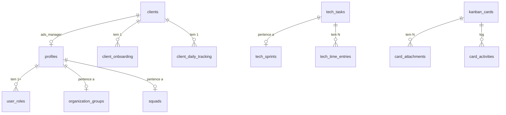

# Modelo de Dados

> [!abstract] Como ler esta nota
> ~192 migrations, dezenas de tabelas. Não tento listar tudo — tento dar o **mapa mental**: por domínio, o que é primário, o que é log, o que é pivot, e onde encontrar os detalhes. O catálogo vivo é `src/integrations/supabase/types.ts` (auto-gerado).

## Domínios

## 1. Auth e Identidade

| Tabela | PK | Papel |
|---|---|---|
| `auth.users` | id | Supabase Auth — e-mail, senha, JWT claims |
| `profiles` | user_id (FK auth.users) | Perfil rico: `name`, `avatar`, `group_id`, `squad_id`, `category_id`, `is_coringa`, `additional_pages[]`, `can_access_mtech`, `department` |
| `user_roles` | (user_id, role) | Enum `user_role`: ceo, cto, devs, gestor_*, consultor_*, design, editor_video, produtora, atrizes_gravacao, rh, financeiro, sucesso_cliente |

> [!info] Por que papel em tabela separada?
> Papel **não vive em `profiles`** porque uma pessoa poderia ter múltiplos papéis no futuro (atualmente é 1:1, mas o modelo permite expansão). E manter papéis em uma tabela à parte simplifica RLS — `user_roles` nunca é lida por usuário comum, só por funções `SECURITY DEFINER`.

Ver [[01-Papeis-e-Permissoes/Papéis do Sistema]].

## 2. Organização

| Tabela | PK | Papel |
|---|---|---|
| `organization_groups` | id | Grupos (Design, Video, Devs, etc.). Hierarquia organizacional. |
| `squads` | id | Sub-times dentro de um grupo (`group_id` FK) |
| `custom_roles` | id | Papéis granulares customizados por squad — `allowed_pages[]`, `is_viewer` |
| `product_categories` | id | Categorias de produto (PRO, Marketplace, etc.) |
| `group_role_limits` | (group_id, role) | Quantos de cada papel cabem num grupo |

Deletar grupo é operação CEO-only via [[04-Integracoes/Edge Functions|edge function `delete-group`]].

## 3. Kanban compartilhado

Infraestrutura usada por **todos** os kanbans por área (Design, Devs, Video, Atrizes, Produtora):

| Tabela | Papel |
|---|---|
| `kanban_boards` | `slug UNIQUE`, `owner_user_id`, `squad_id`. Cada gestor_ads recebe um board na criação do usuário. |
| `kanban_columns` | colunas do board. Nos kanbans por área, são swim lanes: `BY {NOME}`, `JUSTIFICATIVA ({NOME})`. |
| `kanban_cards` | `title`, `description`, `priority`, `status` (string por board), `progress`, `due_date`, `assigned_to`, `created_by`, `tags[]`, `card_type` (design/dev/video/atrizes/produtora). |
| `card_comments` | threads por card |
| `card_activities` | log append-only de ações (move, comment, status change) |
| `card_attachments` | metadados (FK `card_id`, `file_name`, `file_url`, `file_size`); bytes no bucket `card-attachments` |

Briefings específicos por área:

| Tabela | Para qual kanban | Campos típicos |
|---|---|---|
| `design_briefings` | Design | `references_url`, `identity_url`, `client_instagram`, `script_url` |
| `atrizes_briefings` | Atrizes | `client_instagram`, `script_url`, `drive_upload_url` |
| `dev_briefings` | Devs | `materials_url` |
| `video_briefings` | Video | (similares ao design) |
| `produtora_briefings` | Produtora | (similares) |

## 4. Notificações de completion (por área)

Uma tabela por kanban, schema idêntico:

- `dev_completion_notifications`
- `design_completion_notifications`
- `video_completion_notifications`
- `atrizes_completion_notifications`
- `produtora_completion_notifications`

Campos: `id`, `card_id`, `card_title`, `completed_by`, `completed_by_name`, `requester_id`, `requester_name`, `created_at`, `read`, `read_at`.

Disparadas quando um card entra na coluna de aprovação. Lidas em [[03-Features/Notification Center]].

## 5. Mtech (módulo técnico)

Schema dedicado, RLS própria, publication realtime:

| Tabela | Papel |
|---|---|
| `tech_sprints` | `name`, `goal`, `start_date`, `end_date`, `status` (PLANNING/ACTIVE/CLOSED). Unique index: só 1 ACTIVE. |
| `tech_tasks` | task principal. `type`, `status`, `priority`, `sprint_id`, `assignee_id`, `created_by` (IMUTÁVEL via trigger), `deadline`, `estimated_hours`, `acceptance_criteria`, `technical_context`, `git_branch`, `checklist JSONB`, `is_blocked`, `blocker_reason` |
| `tech_task_collaborators` | N:M — `(task_id, user_id)` |
| `tech_time_entries` | timer — `type` (START/PAUSE/RESUME), `seq` para ordenação determinística |
| `tech_task_activities` | log append-only — `type TEXT`, `data JSONB` |
| `tech_task_attachments` | metadados; bytes no bucket `tech-attachments` |
| `tech_task_tags` | N:M de tags |

Ver [[03-Features/Mtech — Milennials Tech]] e [[02-Fluxos/Ciclo de Tasks Mtech]].

## 6. Clientes

| Tabela | Papel |
|---|---|
| `clients` | entidade principal. `cnpj UNIQUE`, `status`, `client_label`, `assigned_ads_manager`, `assigned_comercial`, `assigned_crm`, `assigned_rh`, `assigned_outbound_manager`, `assigned_mktplace`, `contracted_products[]`, `entry_date`, `contract_duration_months`, `payment_due_day`, `campaign_published_at`, `monthly_value`, `sales_percentage` |
| `client_product_values` | valor por produto contratado |
| `client_daily_tracking` | para Ads Manager: `current_day` (segunda..sexta), `last_moved_at`, `is_delayed` |
| `client_onboarding` | posição no onboarding: `current_milestone` (1-6), `current_step` |

Ver [[03-Features/Clientes]] e [[02-Fluxos/Onboarding de Cliente]].

## 7. Ads e Outbound Managers

| Tabela | Papel |
|---|---|
| `ads_tasks` | tasks diárias/semanais do gestor de ads. `task_type` (daily/weekly), `status`, `priority`, `tags[]` |
| `ads_daily_documentation` | doc diária do cliente — métricas, ações, combinado |
| `ads_justifications` | justificativas de atraso/mudança |
| `ads_task_comments` | comentários em ads_tasks |
| `ads_note_notifications` | notificação de nota em task |
| `outbound_tasks` | mesmo schema de ads_tasks mas para outbound manager |
| `outbound_*` | espelha o modelo de ads para prospecção |
| `client_results_reports` | relatórios de 30 dias — ver [[03-Features/Results Reports]] |

## 8. Onboarding de cliente (automação)

| Tabela | Papel |
|---|---|
| `onboarding_tasks` | task individual do fluxo de onboarding. `task_type`, `status`, `due_date`, `milestone`, `assigned_to`, `completed_at` |
| `client_onboarding` | estado agregado: `current_milestone`, `current_step`, `milestone_*_started_at`, `completed_at` |

Tipos de task e automação: ver [[02-Fluxos/Onboarding de Cliente]].

## 9. Financeiro

| Tabela | Papel |
|---|---|
| `financeiro_client_onboarding` | passos do onboarding financeiro por produto |
| `financeiro_active_clients` | clientes ativos com valor mensal e status de fatura |
| `financeiro_tasks` | tasks de cobrança/configuração |
| `financeiro_kanban_tasks` | board interno de financeiro |
| `contas_receber` / `receivables` | contas a receber — due_date, amount, status |
| `mrr_changes` | log de mudanças de MRR (upsells, downgrades, churn) |

## 10. Notificações agregadas

| Tabela | Papel |
|---|---|
| `system_notifications` | notificações genéricas — `type`, `title`, `description`, `read_at` |
| `task_delay_notifications` | task atrasada genérica |
| `task_delay_justifications` | justificativa de atraso |
| `churn_notifications` | cliente em risco — `risk_level`, `reason` |
| `churn_notification_dismissals` | dismiss por usuário |
| `ads_new_client_notifications` | novo cliente atribuído ao gestor |

Leitor único: [[03-Features/Notification Center]].

## 11. Públicas e misc

| Tabela | Papel |
|---|---|
| `nps_surveys` | `token UNIQUE`, respostas de NPS |
| `trainings` | aulas/treinamentos — `allowed_roles[]`, `class_date`, `class_links[]` |
| `pro_tools` | links curados |
| `company_content` | páginas estáticas da empresa |
| `upsells` | oportunidades de upsell por produto |
| `okrs` | OKRs com `assigned_to`, `deadline` |
| `weekly_problems` / `weekly_summaries` / `meetings_one_on_one` | rituais semanais |
| `api_keys` / `api_logs` | autenticação e rate-limit da [[04-Integracoes/API REST v1]] |

## Convenções

> [!tip] Convenções de schema
> - **Timestamps**: `created_at`, `updated_at` (via trigger `moddatetime`). Sempre `timestamp with time zone`.
> - **FK**: sempre nomeado `<tabela>_id` (ou `user_id` quando aponta para auth.users).
> - **Soft delete**: preferência por `archived boolean`. Hard delete só em casos explícitos (ex.: grupo).
> - **Enum vs string**: enums Postgres para estados fechados (status de task); TEXT para strings abertas (tags, labels).
> - **JSONB**: usar quando o shape é variável (`card_activities.details`, `tech_task_activities.data`) ou configuração (`checklist` em tech_tasks).

## Relações críticas a memorizar

## Onde ver o schema vivo

- `src/integrations/supabase/types.ts` — regen via `npm run supabase:gen-types`
- Migrations: `supabase/migrations/` — histórico completo
- Supabase Studio (local): `supabase start` → <http://localhost:54323>
