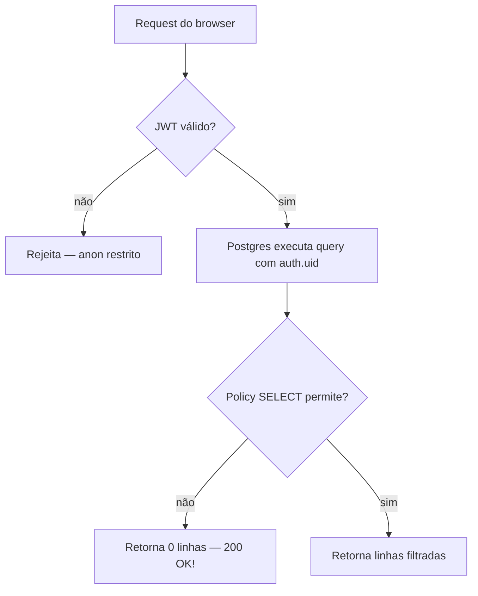

# Supabase e RLS

> [!abstract] A ideia central
> **Row Level Security (RLS)** do Postgres é a autoridade final sobre quem vê e modifica o quê. O frontend não é fonte de verdade — ele só **renderiza o que o banco autoriza**. Isso significa: se você desabilita um botão no React mas esquece a policy, um atacante com o anon key ainda lê os dados.

## O modelo em 3 camadas



> [!warning] Pegadinha clássica
> RLS **não retorna 403 ou 401**. Retorna `200 OK` com array vazio. Se o usuário está "vendo lista vazia quando deveria ver dados", **quase sempre é RLS**. Foi exatamente isso que aconteceu com [[01-Papeis-e-Permissoes/Hierarquia Executiva|o CTO em abril/2026]].

## Helpers canônicas

As policies não repetem a lógica de papel. Elas chamam helpers `SECURITY DEFINER`:

| Função | O que retorna | Arquivo |
|---|---|---|
| `is_ceo(_user_id uuid)` | `true` para role IN ('ceo','cto') | `supabase/migrations/20260416130000_is_ceo_includes_cto.sql` |
| `is_executive(_user_id uuid)` | Idem (alias semântico) | `20260415120001_add_cto_role_functions.sql` |
| `is_admin(_user_id uuid)` | role IN ('ceo','cto','gestor_projetos') | `20260415120001` |
| `has_role(_user_id, _role)` | `true` se usuário tem aquele papel | `20260110183415` |
| `can_view_user(_viewer, _target)` | visibilidade profile-a-profile (grupo/squad/self) | `20260110191514` |
| `can_view_board(_user, _board)` | executivo bypass; senão match squad/group/category | `20260415100000` |
| `can_see_tech(_user_id)` | CEO/CTO/Devs **ou** `profiles.can_access_mtech=true` | `20260417150000` |
| `tech_can_edit_task(_task_id)` | executivo, assignee ou collaborator | `20260415120600` |
| `tech_timer_is_active(_task_id, _user_id)` | última entry é START ou RESUME | `20260415120600` |

Detalhes e padrões de uso: [[01-Papeis-e-Permissoes/Funções RLS]].

## Padrões de policy

### Padrão 1 — "Authenticated read, admin write"

```sql
-- SELECT: qualquer autenticado
CREATE POLICY "read for auth" ON pro_tools
  FOR SELECT TO authenticated USING (true);

-- INSERT/UPDATE/DELETE: só executivos
CREATE POLICY "admin write" ON pro_tools
  FOR ALL TO authenticated
  USING (public.is_ceo(auth.uid()))
  WITH CHECK (public.is_ceo(auth.uid()));
```

Usado em: `pro_tools`, `company_content`, `trainings`, `product_categories`.

### Padrão 2 — "Scoped read, self write"

```sql
-- SELECT: viewer pode ver targets do mesmo squad/grupo
CREATE POLICY "scoped profile read" ON profiles
  FOR SELECT TO authenticated
  USING (public.can_view_user(auth.uid(), user_id));

-- UPDATE: só o próprio usuário OU admin
CREATE POLICY "self or admin update" ON profiles
  FOR UPDATE TO authenticated
  USING (user_id = auth.uid() OR public.is_admin(auth.uid()));
```

Usado em: `profiles`, `user_roles`, `kanban_boards`.

### Padrão 3 — "Gate por função específica"

```sql
CREATE POLICY "tech task read" ON tech_tasks
  FOR SELECT TO authenticated
  USING (public.can_see_tech(auth.uid()));
```

Usado em: todas as `tech_*`, `ads_tasks`, `outbound_tasks`, `client_onboarding`.

### Padrão 4 — "Trigger de invariante"

Quando a regra de negócio é **imutabilidade** ou **guard condicional**, policy não basta. Usamos trigger BEFORE:

```sql
-- profiles.can_access_mtech só pode ser alterado por admins
CREATE TRIGGER trg_profiles_guard_mtech_access
  BEFORE UPDATE ON profiles
  FOR EACH ROW EXECUTE FUNCTION profiles_guard_mtech_access();
```

Ver [[01-Papeis-e-Permissoes/Flag can_access_mtech]].

## Quando NÃO usar RLS (e usar RPC)

RLS cobre 95% dos casos. Os 5% restantes viram **RPC `SECURITY DEFINER`**:

1. **Operação multi-tabela atômica.** Ex.: `tech_start_timer()` insere em `tech_time_entries` + pausa outros timers + move status de task. Tudo em uma transação.
2. **Lógica de negócio impura.** Ex.: `set_mtech_access()` checa papel do chamador, valida target, insere audit log.
3. **Bypass controlado.** Ex.: `force_delete_user_cleanup()` precisa deletar 24 tabelas sem RLS derrubar o cascade.

RPCs vivem em `supabase/migrations/*.sql` com comentário de propósito no topo. **Toda RPC deve começar checando `auth.uid()` e a autorização do chamador** — não confiar em "já passou pela RLS para chegar aqui".

## Edge functions e service_role

[[04-Integracoes/Edge Functions|Edge Functions]] usam o `SUPABASE_SERVICE_ROLE_KEY`, que **bypassa RLS completamente**. Por isso **toda edge function deve**:

1. Validar o JWT do chamador via `supabaseClient.auth.getUser(token)`.
2. Chamar `is_ceo()` (ou a policy adequada) explicitamente antes de qualquer mutação.
3. Nunca aceitar `user_id` como parâmetro sem verificar se o JWT corresponde (prevenção de IDOR).

Exemplo canônico: `supabase/functions/create-user/index.ts:50-65`.

## Realtime e RLS

Realtime do Postgres **respeita RLS**: o cliente só recebe eventos das linhas que teria acesso via SELECT. Portanto:

- Subscribe sem JWT → não recebe nada.
- Subscribe com JWT de papel restrito → recebe só o que aquele papel SELECT-a.

Tabelas no publication: ver [[00-Arquitetura/Realtime e Polling]].

## Testando RLS

> [!example] Pattern pgTAP para regressão
> Ver `supabase/tests/is_ceo_cto_test.sql`. Padrão:
> 1. INSERT usuários em cada papel relevante.
> 2. Chamar a função/policy com aquele UUID.
> 3. Assertar comportamento.
> 4. `ROLLBACK` ao final — teste não polui o DB.
>
> Rodar com `npm run test:db`.

## Checklist para nova tabela

> [!todo] Antes de criar uma tabela
> - [ ] `ENABLE ROW LEVEL SECURITY` na migration
> - [ ] Ao menos uma policy de SELECT (ou nenhum usuário verá)
> - [ ] Policy de INSERT/UPDATE/DELETE que use `is_*`/`can_*` helpers, não literal de role
> - [ ] Índice nas FKs usadas em policies (performance)
> - [ ] Trigger `updated_at` via `moddatetime` se a tabela tem esse campo
> - [ ] pgTAP test cobrindo os papéis esperados

## Links relacionados

- [[01-Papeis-e-Permissoes/Funções RLS]]
- [[01-Papeis-e-Permissoes/Hierarquia Executiva]] (o incidente do CTO)
- [[02-Fluxos/Criação de Usuário]] (como JWT + profiles + user_roles se juntam)
- [[04-Integracoes/Edge Functions]]
