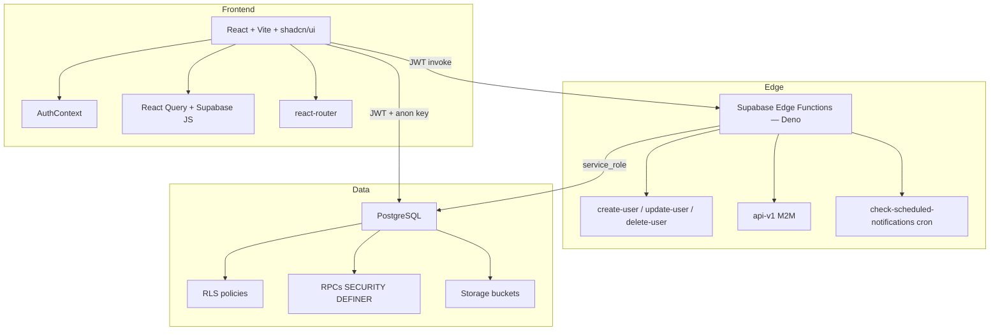

# Visão Geral

> [!abstract] Em uma frase
> É um **ERP operacional interno** que orquestra o trabalho de uma agência de growth — do cadastro do cliente até o relatório mensal — através de kanbans por área, rotinas diárias/semanais automatizadas, e um módulo de gestão técnica (Mtech) para o time de engenharia.

## O que o sistema faz

O produto atende **quatro audiências simultâneas**, cada uma com sua lente:

1. **Executivos (CEO, CTO, Gestor de Projetos)** — veem tudo, auditam, tomam decisão.
2. **Gestores de área** (ads, outbound, CS, comercial, CRM, marketplace) — têm rotinas diárias próprias e dashboards PRO+ específicos por rota.
3. **Execução** (design, video, devs, atrizes, produtora, RH) — operam em kanbans por swim lanes de pessoa.
4. **Clientes finais** — acessam páginas públicas por token para responder NPS, diagnósticos, e visualizar estratégias/resultados.

Ver [[01-Papeis-e-Permissoes/Papéis do Sistema|a lista completa dos 17 papéis]] e [[01-Papeis-e-Permissoes/Matriz de Permissões|o que cada um enxerga]].

## O que o sistema NÃO é

- **Não é um CRM.** O CRM de vendas é externo (Torque); esta plataforma se integra via [[04-Integracoes/API REST v1|API REST v1]].
- **Não é um contábil.** Dados financeiros (`financeiro_*`) são operacionais (onboarding de contratos, tasks de cobrança), não contabilidade fiscal.
- **Não é multi-tenant.** Uma instância por empresa. O modelo de [[03-Features/Groups, Squads e Custom Roles|Groups/Squads]] é organizacional interno, não isolamento tenant.

## Arquitetura em 3 camadas

- **Frontend**: SPA em React servido pela [[04-Integracoes/Vercel e CSP|Vercel]]. Toda interação com dados passa por `supabase-js` com o JWT do usuário — [[00-Arquitetura/Supabase e RLS|RLS decide o que volta]].
- **Edge**: Funções Deno na Supabase para operações que **exigem service_role** (criar/deletar usuário no auth, M2M, crons) ou **transformações AI** (relatórios).
- **Data**: Postgres com RLS pervasiva. Triggers garantem invariantes (ex.: `created_by` imutável em tech_tasks). RPCs `SECURITY DEFINER` são os únicos caminhos para mutações que precisam bypass RLS controlado.

Detalhes em [[00-Arquitetura/Stack Técnica|Stack Técnica]].

## Os dois motores do sistema

### Motor 1 — Rotinas diárias/semanais de gestores

Cada cliente tem um **gestor de ads** e um **outbound manager** (opcional). O produto impõe uma rotina:

- **Diária**: o gestor abre `/ads-manager`, vê seus clientes organizados por dia da semana ([[02-Fluxos/Ciclo Diário do Ads Manager|Ciclo Diário]]), documenta métricas + ações, registra "combinados" (promessas ao cliente) que viram tasks com prazo.
- **Semanal**: terça-feira uma edge function agenda tasks automáticas ([[02-Fluxos/Ciclo Semanal|enviar relatório, enviar lema]]). Se não forem cumpridas, viram alertas executivos.
- **30 dias**: ciclo de [[02-Fluxos/Geração de Results Report|Results Report]] — relatório para apresentar ao cliente. Gera auto-task "Apresentar PDF" com prazo de 3 dias.

### Motor 2 — Kanbans de execução

Para cada área produtiva ([[03-Features/Kanbans por Área|Design, Video, Devs, Atrizes, Produtora]]), há um kanban onde:

- **Colunas são swim lanes por pessoa** (`BY {NOME}`), não por status. Cada pessoa da área tem sua própria coluna.
- **Status** (`a_fazer`, `fazendo`, `alteracao`, `aguardando_aprovacao`/`para_aprovacao`, `aprovado`) vive no card, não na coluna.
- **Briefings** ficam em tabelas específicas (`design_briefings`, `atrizes_briefings`, etc.) — links de referência, scripts, Instagram do cliente.
- **Completion notifications**: mover card para a coluna de aprovação dispara notificação para o criador do briefing.

Contraste com o [[03-Features/Mtech — Milennials Tech|Mtech]], que usa status fixos (BACKLOG → TODO → IN_PROGRESS → REVIEW → DONE) no estilo Scrum, com sprints e time tracking.

## Convenções e princípios

> [!tip] Princípios não-negociáveis
> 1. **Segurança desde o primeiro commit.** RLS ligado em praticamente tudo. Service role só em edge functions auditáveis.
> 2. **Imutabilidade estratégica.** `created_by` em `tech_tasks` é trancado por trigger. Logs de atividade (`card_activities`, `tech_task_activities`) são append-only.
> 3. **Automação com justificativa.** Quando uma task muda de estado "terminal" (done, aprovado), o sistema pede justificativa (J8, J10, J11) — auditoria > velocidade.
> 4. **Público por token.** Páginas de cliente não têm login. Um token único no banco é o único gate.

## Próximas paradas

- Para entender **a cola que mantém tudo junto**: [[00-Arquitetura/Supabase e RLS]]
- Para entender **quem pode o quê**: [[01-Papeis-e-Permissoes/Matriz de Permissões]]
- Para rastrear **o que acontece quando você cria um usuário**: [[02-Fluxos/Criação de Usuário]]
- Para entender **o módulo técnico**: [[03-Features/Mtech — Milennials Tech]]
