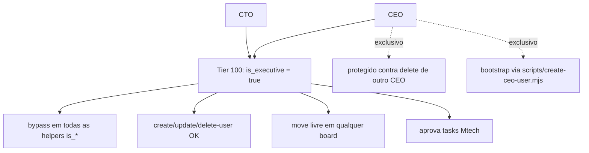

# Hierarquia Executiva (CEO e CTO)

> [!abstract] O princípio
> **CEO e CTO são equivalentes em poder.** Não há hierarquia entre eles. Toda policy de RLS, todo guard de frontend, toda edge function deve tratar os dois como "executivos". O que importa é a função `is_executive()` (ou o alias legado `is_ceo()`), nunca o literal `role = 'ceo'`.

## Histórico: o incidente de 2026-04-16

Adicionamos o papel `cto` na migration `20260415120000_add_cto_role.sql`. A auditoria feita naquela migration afirmava que **nenhuma policy referenciava o literal 'ceo'** — portanto, bastaria adicionar o novo papel ao enum e seguir. Aquela auditoria estava errada.

Na prática:
- **14 migrations** chamavam `is_ceo(auth.uid())` como gate de autorização (clients, profiles, kanban_boards, onboarding_*, pro_tools, company_content, group_role_limits, product_categories, trainings, custom_roles, organization_groups, squads, independent_categories, user_roles CUD, ads_*_notifications).
- A função `is_ceo()` original retornava `true` **apenas** para `role = 'ceo'`.
- A migration `20260415120001` introduziu `is_executive()` mas **nenhuma policy foi reescrita** para usá-la.
- Resultado: o CTO logava, via um banner dizendo "logado como CTO", e via **listas vazias em todo lugar** — clientes, perfis, kanbans, onboarding. RLS retorna 200 OK com 0 linhas quando bloqueia, então parecia "sistema vazio", não "bloqueado".

A correção foi `20260416130000_is_ceo_includes_cto.sql`:

```sql
CREATE OR REPLACE FUNCTION public.is_ceo(_user_id uuid)
RETURNS boolean
LANGUAGE sql
STABLE
SECURITY DEFINER
SET search_path = public
AS $$
  SELECT EXISTS (
    SELECT 1
    FROM public.user_roles
    WHERE user_id = _user_id
      AND role IN ('ceo', 'cto')
  )
$$;
```

Redefinimos a função em vez de reescrever 14 policies. Trade-off consciente: nome de função semanticamente desalinhado (`is_ceo` inclui CTO), mas resolveu todos os bugs de uma vez sem risco de missed policy.

Proteção contra regressão: `supabase/tests/is_ceo_cto_test.sql` — pgTAP que falha se alguém reverter ou narrow a função.

## Regras de ouro

> [!danger] NÃO FAÇA
> - **Nunca escreva `role = 'ceo'`** em policy, trigger, function, ou frontend. Use sempre `is_executive()` ou `is_ceo()` (alias).
> - **Nunca assuma que a auditoria de grep cobriu tudo.** Policies podem referenciar funções que referenciam outras funções. Use pgTAP.
> - **Nunca narrow `is_ceo()` de volta.** O teste pgTAP vai quebrar. Se precisar distinguir CEO de CTO (ex.: só CEO deleta outro CEO), crie uma função nova específica — não mude a genérica.

> [!tip] FAÇA
> - **Prefira `is_executive()`** em código novo. É o nome canônico.
> - **Mantenha `is_ceo()` como alias** (backward-compat). É o que as 14 policies legadas chamam.
> - **Ao adicionar um novo "papel executivo"** (hipotético; por ora CEO e CTO bastam), adicione no `IN (...)` das duas funções simultaneamente.

## Distinções reais entre CEO e CTO

Há **poucas**, e ficam em lugares específicos:

1. **`delete-user` edge**: impede deletar usuário que é CEO (proteção "last man standing"). Não impede deletar CTO. Se quiser simétrico, abra um PR. Arquivo: `supabase/functions/delete-user/index.ts:55-61`.
2. **Bootstrap do primeiro CEO**: via `scripts/create-ceo-user.mjs` (usa service role key em `.env.scripts`). Não existe equivalente edge function — a antiga `setup-ceo` foi removida em abril/2026. CTO é criado via `scripts/create-cto-user.mjs` ou pela CreateUserModal por um CEO.
3. **`ROLE_HIERARCHY`** em `src/types/auth.ts`: CEO = 100, CTO = 100. Empate. Usado em filtros de UI onde se precisa "maior ou igual" — ambos passam.

## Criação de um CTO

Dois caminhos:

1. **CEO via UI**: CreateUserModal → escolher role=CTO.
2. **CEO via script**: `node scripts/create-cto-user.mjs` (precisa `SUPABASE_SERVICE_ROLE_KEY` em `.env.scripts`). Arquivo: `scripts/create-cto-user.mjs:1-80`.

## Diagrama



## Checklist para features que afetam executivos

> [!todo] Antes de fazer merge
> - [ ] Toda policy nova usa `is_executive()` ou `is_ceo()` (alias), não literal
> - [ ] Se adicionar caminho de bypass, pgTAP cobre CEO **e** CTO
> - [ ] Se o feature tem UI de "quem é admin", mostra CEO e CTO
> - [ ] Label em PT usa `ROLE_LABELS` — sem hardcode de "CEO"
> - [ ] Considerar: essa feature deveria distinguir os dois? Se sim, nova função específica (ex.: `is_primary_founder()`)

## Links

- [[01-Papeis-e-Permissoes/Funções RLS]]
- [[01-Papeis-e-Permissoes/Matriz de Permissões]]
- [[02-Fluxos/Criação de Usuário]]
- [[05-Operacoes/Migrations]] (teste pgTAP é `supabase/tests/is_ceo_cto_test.sql`)
