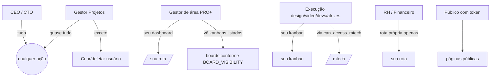

# Matriz de Permissões

> [!abstract] A tabela canônica
> Quando houver dúvida de "esse papel pode X?", consulte primeiro esta nota. Se a tabela não cobre o caso, leia o código de `src/types/auth.ts` e a policy relevante — e **atualize esta nota** para o próximo leitor.

## Capacidades executivas

| Capacidade | CEO | CTO | Gestor Projetos | Outros |
|---|:---:|:---:|:---:|:---:|
| Criar usuário | ✅ | ✅ | ❌ | ❌ |
| Editar usuário | ✅ | ✅ | ❌ | ❌ |
| Deletar usuário | ✅ (exceto outro CEO) | ✅ (exceto outro CEO) | ❌ | ❌ |
| Criar grupo | ✅ | ✅ | ❌ | ❌ |
| Deletar grupo | ✅ | ✅ | ❌ | ❌ |
| Toggle `can_access_mtech` | ✅ | ✅ | ✅ | ❌ (exceto sucesso_cliente) |
| Ver todos os clientes | ✅ | ✅ | ✅ | Gestores veem só os assignados |
| Ver todos os usuários | ✅ | ✅ | ✅ | Filtrado por `can_view_user()` |
| Criar tab em board | ✅ | ✅ | ✅ | ❌ |
| Mover cards livremente (qualquer coluna) | ✅ | ✅ | ✅ | ❌ |
| Aprovar/rejeitar task Mtech | ✅ | ✅ | ❌ | ❌ |

Fonte: `src/types/auth.ts:196-243` (`canManageUsers`, `canCreateTab`, `canMoveCardsFreely`).

## Rotas PRO+ (dashboards por gestor)

Cada papel com dashboard próprio tem rota dedicada:

| Papel | Rota | Componente |
|---|---|---|
| `gestor_ads` | `/gestor-ads` | AdsManagerPage |
| `outbound` | `/millennials-outbound` | OutboundManagerPage |
| `sucesso_cliente` | `/sucesso-cliente` | SucessoClientePage |
| `consultor_comercial` | `/consultor-comercial` | ConsultorComercialPage |
| `consultor_mktplace` | `/consultor-mktplace` | ConsultorMktplacePage |
| `financeiro` | `/financeiro` | FinanceiroPage |
| `gestor_projetos` | `/gestor-projetos` | GestorProjetosPage |
| `gestor_crm` | `/gestor-crm` | GestorCRMPage |
| `design` | `/design` | DesignPage (+ kanban) |
| `editor_video` | `/editor-video` | EditorVideoPage |
| `devs` | `/devs` | DevsPage |
| `atrizes_gravacao` | `/atrizes-gravacao` | AtrizesPage |

Executivos acessam **todas**.

## Visibilidade de kanbans por papel

Map canônico: `BOARD_VISIBILITY` em `src/types/auth.ts:71-159`.

| Papel | Boards visíveis |
|---|---|
| ceo, cto, gestor_projetos | `['*']` — todos |
| gestor_ads | ads, design, editor-video, devs, produtora, atrizes, gestor-crm, consultor-comercial, consultor-mktplace |
| outbound | mesmo que gestor_ads |
| sucesso_cliente | mesmo que gestor_ads + **sucesso, rh** |
| design | design (próprio) |
| editor_video | editor-video (próprio) |
| devs | devs + design |
| atrizes_gravacao | atrizes + próprio pool |
| consultor_comercial | comercial, paddock |
| consultor_mktplace | mktplace |
| gestor_crm, produtora | sem kanban (acesso só via integração) |
| financeiro, rh | nenhum kanban de área; só rota própria |

## Ações em cards de kanban (por board)

Cada board define seu `canMove{Board}Card(role)` em `src/hooks/use{Board}Kanban.ts`.

**Pode mover cards em Devs/Design/Video/Atrizes/Produtora**: `ceo`, `cto`, `gestor_projetos`, `gestor_ads`, `sucesso_cliente`, `{role da área}`.

**Pode mover no RH Jornada Equipe**: `ceo`, `cto`, `gestor_projetos` (apenas).

**Pode mover no Mtech Kanban**: definido por [[03-Features/Mtech — Milennials Tech#Matriz de transições|transição-específica]] via `canDragToColumn()` em `src/features/milennials-tech/lib/permissions.ts`.

## Ações em tasks do Mtech

| Ação | Quem pode | RPC |
|---|---|---|
| Submeter task (`/submit-task`) | qualquer autenticado | `submit_task()` |
| Atribuir task | executivo, gestor_projetos | direct update |
| Start/pause/resume timer | executivo, assignee, collaborator | `tech_start_timer`, `tech_pause_timer`, `tech_resume_timer` |
| Enviar para REVIEW | assignee ou collaborator | `tech_send_to_review` |
| Aprovar/rejeitar (REVIEW → DONE/IN_PROGRESS) | executivo apenas | `tech_approve_task`, `tech_reject_task` |
| Bloquear/desbloquear | assignee, collaborator | `tech_block_task`, `tech_unblock_task` |
| Start/end sprint | executivo apenas | `tech_start_sprint`, `tech_end_sprint` |
| Deletar task | executivo apenas | policy + trigger |

Fonte: `supabase/migrations/20260415120600_tech_rpcs.sql`. Ver [[02-Fluxos/Ciclo de Tasks Mtech]].

## Gestão de clientes

| Ação | Quem pode |
|---|---|
| Cadastrar cliente | CEO, CTO, gestor_projetos, sucesso_cliente |
| Editar cliente (info geral) | CEO, CTO, gestor_projetos, sucesso_cliente + gestor atribuído |
| Reatribuir gestor | CEO, CTO, gestor_projetos |
| Setar `client_label` | CEO, CTO, gestor_projetos, sucesso_cliente |
| Mover cliente entre dias (ads tracking) | gestor_ads atribuído |
| Ver financeiro do cliente | CEO, CTO, gestor_projetos, financeiro |

Ver [[03-Features/Clientes]] e [[02-Fluxos/Cadastro de Cliente]].

## Operações sensíveis

| Operação | Quem pode | Por quê |
|---|---|---|
| Invoke `create-user` edge | CEO, CTO | Única via de criar usuário no `auth.users` |
| Invoke `delete-user` edge | CEO, CTO | Cascade delete em 31 tabelas |
| Invoke `delete-group` edge | CEO, CTO | Pode cascatar deleção de usuários |
| Invoke `api-v1` | Holder de API key válida em `api_keys` | M2M, rate-limited |
| Invoke crons (`check-scheduled-notifications`) | Service role (sistema) | Sem JWT de usuário |

## Páginas públicas (sem auth)

| Rota | Quem acessa | Gate |
|---|---|---|
| `/nps/:token` | Qualquer com token válido | `nps_surveys.token` |
| `/diagnostico/:token` | Qualquer com token | Token embutido em URL enviada |
| `/strategy/:token` | Qualquer com token | Idem |
| `/paddock/:token` | Qualquer com token | Idem |
| `/exit-form/:token` | Qualquer com token | Exit survey |
| `/results/:token` | Qualquer com token | Public results report |

Tokens são UUIDs gerados no backend e enviados ao cliente por fora do sistema (e-mail, WhatsApp). Ver [[03-Features/Públicas — NPS, Diagnóstico, Strategy]].

## Exceções por usuário

Dois mecanismos:

1. **`profiles.additional_pages[]`** — array de slugs de rota que aquele usuário vê além do papel. Ex.: editor de vídeo que também participa de reuniões do comercial ganha `'comercial'` no array.

2. **`custom_roles` + `squad_id`** — se o squad do usuário tem custom_role atribuído, o `custom_roles.allowed_pages[]` define os acessos. Sobrepõe o padrão do papel.

Ambos são gerenciados no CreateUserModal/EditUserModal por admins.

## Diagrama mental rápido

## Links

- [[01-Papeis-e-Permissoes/Papéis do Sistema]]
- [[01-Papeis-e-Permissoes/Funções RLS]]
- [[01-Papeis-e-Permissoes/Flag can_access_mtech]]
- [[01-Papeis-e-Permissoes/Hierarquia Executiva]]
