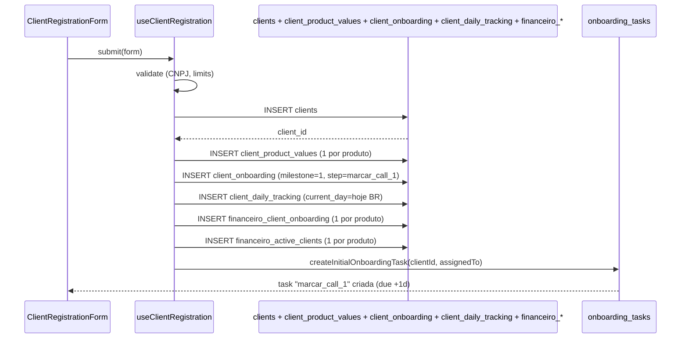

# Cadastro de Cliente

> [!abstract] Resumo
> Cadastrar um cliente **não** é só inserir em `clients`. É o gatilho para uma cascata: registros financeiros por produto, abertura do [[02-Fluxos/Onboarding de Cliente|onboarding]] com a primeira task ("marcar call 1"), criação de trackings diários e atribuição a gestores que **têm limites de capacidade**.

## Quem pode cadastrar

- `ceo`, `cto`, `gestor_projetos`, `sucesso_cliente`.
- Via formulário em `src/components/client-registration/ClientRegistrationForm.tsx`.
- Via API M2M em `POST /api-v1?action=create_client` (integração CRM) — ver [[04-Integracoes/API REST v1]].

## Campos e validações

| Campo | Obrigatório | Validação |
|---|---|---|
| `name` | ✅ | — |
| `razao_social` | ✅ | — |
| `cnpj` | condicional | CNPJ válido; único na tabela |
| `cpf` | condicional | CPF válido (se PF) |
| `niche` | ✅ | string |
| `expected_investment` | ✅ | number |
| `entry_date` | ✅ | date |
| `contract_duration_months` | ✅ | number |
| `payment_due_day` | ✅ | 1-31 |
| `contracted_products[]` | ✅ | array de slugs |
| `product_values{}` | ✅ | valor por produto contratado |
| `torque_crm_products[]` | ❌ | produtos do CRM Torque |
| `assigned_ads_manager` | condicional | se produto de ads; respeita limite |
| `assigned_comercial` | condicional | se venda; respeita limite |
| `assigned_crm` | condicional | se Torque; respeita limite |
| `assigned_rh` | ❌ | — |
| `assigned_outbound_manager` | ❌ | se outbound; respeita limite |
| `assigned_mktplace` | condicional | se MKT Place; respeita limite |

## Limites de gestor (`MANAGER_LIMITS`)

Definição em `src/lib/clientValidation.ts` (ou similar). Valores canônicos:

| Papel | Max clientes |
|---|---|
| `gestor_ads` | **25** |
| `consultor_comercial` | 80 |
| `consultor_mktplace` | 80 |
| `gestor_crm` | 80 |
| `outbound` | 80 |

Validação no frontend antes do submit + revalidada no backend.

## Fluxo

Implementado em `src/hooks/useClientRegistration.ts` e `src/hooks/useOnboardingAutomation.ts`.

## Efeitos colaterais

### Onboarding aberto

`client_onboarding` é criado com `current_milestone=1`, `current_step='marcar_call_1'`. A primeira task auto-criada é `marcar_call_1`, atribuída ao `assigned_ads_manager` (ou `effectiveUserId` ou quem criou, nessa ordem de fallback — ver `useCreateInitialOnboardingTask`). Due date = +1 dia.

Detalhes: [[02-Fluxos/Onboarding de Cliente]].

### Daily tracking aberto (quando aplicável)

Para cliente de ads, `client_daily_tracking` é inserido com `current_day` calculado a partir do dia da semana em Brazil TZ. O cliente começa a aparecer no [[03-Features/Ads Manager|Ads Manager]] do gestor no dia correspondente.

### Financeiro preparado

Para cada produto em `contracted_products[]`:
- Linha em `financeiro_client_onboarding` com `current_step` default
- Linha em `financeiro_active_clients` com `monthly_value`, `contract_expires_at`

Permite que o financeiro veja o cliente no seu dashboard.

### Campanha NÃO publicada ainda

`clients.campaign_published_at` fica **NULL** até o onboarding avançar ao milestone 5 (`publicar_campanha`). Só depois o cliente entra na [[03-Features/Ads Manager#Acompanhamento|aba de Acompanhamento do Ads Manager]].

## API M2M

Quando cadastro vem via `api-v1`:

- **Assignments ficam NULL**. É responsabilidade do admin atribuir manualmente depois. Decisão de design: integração M2M cria cliente "cru", humano aloca.
- Validações de CNPJ, duplicata, formato são as mesmas.
- Rate limit de 60 req/min por API key.

Ver [[04-Integracoes/API REST v1]].

## Erros comuns

| Erro | Causa |
|---|---|
| "Gestor de Ads atingiu limite" | Gestor com ≥25 clientes; escolher outro ou aumentar limite |
| "CNPJ já cadastrado" | Duplicata em `clients.cnpj` |
| "Produto sem valor" | `product_values` faltando chave para produto em `contracted_products` |
| "assigned_* inválido" | UUID não existe em `profiles` ou usuário tem papel incompatível |

## Links

- [[02-Fluxos/Onboarding de Cliente]]
- [[03-Features/Clientes]]
- [[03-Features/Ads Manager]]
- [[04-Integracoes/API REST v1]]
