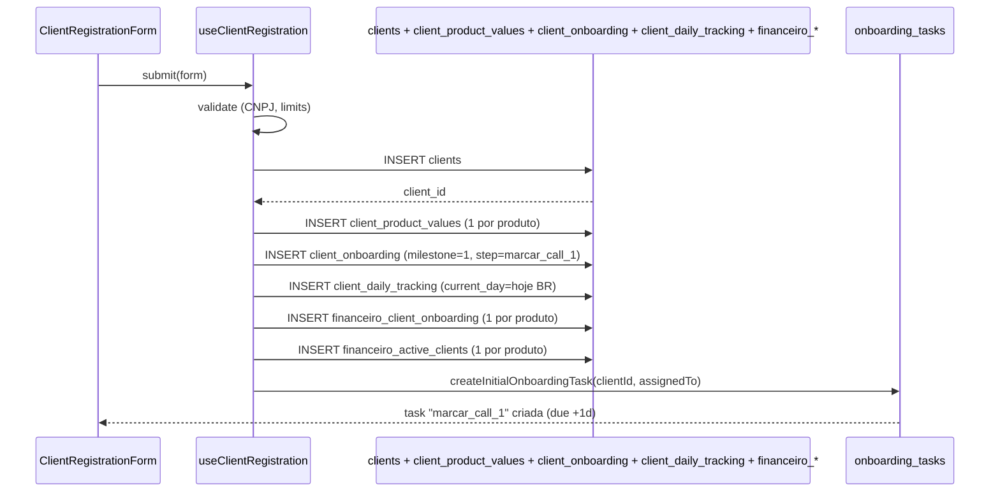

# Cadastro de Cliente

> [!abstract] Resumo
> Cadastrar um cliente **não** é só inserir em `clients`. É o gatilho para uma cascata: registros financeiros por produto, abertura do [[02-Fluxos/Onboarding de Cliente|onboarding]] com a primeira task ("marcar call 1"), criação de trackings diários e atribuição a gestores que **têm limites de capacidade**.

## Quem pode cadastrar

- `ceo`, `cto`, `gestor_projetos`, `sucesso_cliente`.
- Via formulário em `src/components/client-registration/ClientRegistrationForm.tsx`.
- Via API M2M em `POST /api-v1?action=create_client` (integração CRM) — ver [[04-Integracoes/API REST v1]].

## Campos e validações

| Campo | Obrigatório | Validação |
|---|---|---|
| `name` | ✅ | — |
| `razao_social` | ✅ | — |
| `cnpj` | condicional | CNPJ válido; único na tabela |
| `cpf` | condicional | CPF válido (se PF) |
| `niche` | ✅ | string |
| `expected_investment` | ✅ | number |
| `entry_date` | ✅ | date |
| `contract_duration_months` | ✅ | number |
| `payment_due_day` | ✅ | 1-31 |
| `contracted_products[]` | ✅ | array de slugs |
| `product_values{}` | ✅ | valor por produto contratado |
| `torque_crm_products[]` | ❌ | produtos do CRM Torque |
| `assigned_ads_manager` | condicional | se produto de ads; respeita limite |
| `assigned_comercial` | condicional | se venda; respeita limite |
| `assigned_crm` | condicional | se Torque; respeita limite |
| `assigned_rh` | ❌ | — |
| `assigned_outbound_manager` | ❌ | se outbound; respeita limite |
| `assigned_mktplace` | condicional | se MKT Place; respeita limite |

## Limites de gestor (`MANAGER_LIMITS`)

Definição em `src/lib/clientValidation.ts` (ou similar). Valores canônicos:

| Papel | Max clientes |
|---|---|
| `gestor_ads` | **25** |
| `consultor_comercial` | 80 |
| `consultor_mktplace` | 80 |
| `gestor_crm` | 80 |
| `outbound` | 80 |

Validação no frontend antes do submit + revalidada no backend.

## Fluxo



Implementado em `src/hooks/useClientRegistration.ts` e `src/hooks/useOnboardingAutomation.ts`.

## Efeitos colaterais

### Onboarding aberto

`client_onboarding` é criado com `current_milestone=1`, `current_step='marcar_call_1'`. A primeira task auto-criada é `marcar_call_1`, atribuída ao `assigned_ads_manager` (ou `effectiveUserId` ou quem criou, nessa ordem de fallback — ver `useCreateInitialOnboardingTask`). Due date = +1 dia.

Detalhes: [[02-Fluxos/Onboarding de Cliente]].

### Daily tracking aberto (quando aplicável)

Para cliente de ads, `client_daily_tracking` é inserido com `current_day` calculado a partir do dia da semana em Brazil TZ. O cliente começa a aparecer no [[03-Features/Ads Manager|Ads Manager]] do gestor no dia correspondente.

### Financeiro preparado

Para cada produto em `contracted_products[]`:
- Linha em `financeiro_client_onboarding` com `current_step` default
- Linha em `financeiro_active_clients` com `monthly_value`, `contract_expires_at`

Permite que o financeiro veja o cliente no seu dashboard.

### Campanha NÃO publicada ainda

`clients.campaign_published_at` fica **NULL** até o onboarding avançar ao milestone 5 (`publicar_campanha`). Só depois o cliente entra na [[03-Features/Ads Manager#Acompanhamento|aba de Acompanhamento do Ads Manager]].

## API M2M

Quando cadastro vem via `api-v1`:

- **Assignments ficam NULL**. É responsabilidade do admin atribuir manualmente depois. Decisão de design: integração M2M cria cliente "cru", humano aloca.
- Validações de CNPJ, duplicata, formato são as mesmas.
- Rate limit de 60 req/min por API key.

Ver [[04-Integracoes/API REST v1]].

## Erros comuns

| Erro | Causa |
|---|---|
| "Gestor de Ads atingiu limite" | Gestor com ≥25 clientes; escolher outro ou aumentar limite |
| "CNPJ já cadastrado" | Duplicata em `clients.cnpj` |
| "Produto sem valor" | `product_values` faltando chave para produto em `contracted_products` |
| "assigned_* inválido" | UUID não existe em `profiles` ou usuário tem papel incompatível |

## RPC transacional (feature flag `use_rpc_client_creation`)

> [!note] Wave 1, Track B.2
> Implementada em `supabase/migrations/20260420210000_rpc_create_client_with_automations.sql`.
> Design: `docs/superpowers/specs/2026-04-20-rpc-create-client-with-automations-design.md`.
> Hook legado NÃO foi removido — a nova RPC coexiste atrás de feature flag. Quando a flag estiver ON, o hook chama a RPC; quando OFF, usa o caminho antigo.

### Por que existir

O hook legado em `src/hooks/useClientRegistration.ts:295-605` executa **9 inserts em sequência** do client-side, sem atomicidade. Se o insert 5 falha, os 4 primeiros já commitaram → cliente órfão. Em produção o bug se manifestou como clientes sem `financeiro_tasks` ou sem `onboarding_tasks`, invisíveis pra times downstream. A RPC move tudo pra Postgres num único `BEGIN...EXCEPTION...` — qualquer falha dispara rollback total.

### Quando é usada

Consumida pelo hook `useCreateClient` **apenas quando** `is_feature_enabled('use_rpc_client_creation', auth.uid())` retorna true. A flag tem três eixos:
- `enabled: bool` — liga pra todo mundo (fase 3 do rollout).
- `allowed_users: uuid[]` — liga só para UUIDs explícitos (fase 2, preview fundador).
- `rollout_percentage: int` — bucketing estável por hash do UUID (fase progressiva).

Por default: `enabled=false, allowed_users={}, rollout_percentage=0` → ninguém usa a RPC. Só admin (`is_admin()`) pode mutar `feature_flags`.

### Assinatura

```sql
public.create_client_with_automations(
  p_payload         jsonb,
  p_idempotency_key text DEFAULT NULL
) RETURNS jsonb
```

`p_payload` espelha 1:1 a interface `NewClientData` do hook (campos em `src/hooks/useClientRegistration.ts:59-84`). `p_idempotency_key` é opcional — se fornecido, protege contra double-submit por 24h.

Retorno:
```json
{
  "client_id": "uuid",
  "automations_executed": ["insert_client", "ads_notification", "onboarding_task", ...],
  "warnings": ["pm_welcome_task_skipped: no gestor_projetos in group"],
  "idempotent_hit": false,
  "schema_version": 1
}
```

### Permissões

`GRANT EXECUTE TO authenticated` — mas a função **re-valida** internamente (Phase 2): só passa se caller for `is_executive() OR has_role(user, 'gestor_projetos') OR has_role(user, 'financeiro')`. Outros papéis recebem `ERRCODE P0003`.

### Error codes → tratamento frontend

| `error.code` | Significado | Toast sugerido |
|---|---|---|
| `P0001` | Erro genérico de automação (step embutido na mensagem) | "Erro ao cadastrar cliente. Tente novamente." + log |
| `P0002` | Payload inválido (campo obrigatório ausente, range inválido) | Mensagem específica — corrigir no form |
| `P0003` | Permissão negada | "Você não tem permissão pra criar clientes." |
| `P0004` | CNPJ duplicado (`idx_clients_cnpj_unique`) | "CNPJ já cadastrado" |
| `P0005` | Outra unique violation | "Dado duplicado: {detail}" |
| `P0006` | Foreign key violation (squad_id/group_id inexistente) | "Referência inválida: {detail}" |

No supabase-js, a convenção é `error.code === 'P0004'`.

### Rollback behavior

Qualquer `RAISE EXCEPTION` dentro da função (incluindo dos handlers `WHEN unique_violation`, `WHEN foreign_key_violation` etc.) dispara rollback automático de **todos** os inserts da transação — incluindo os disparados por triggers (`trigger_create_client_cards`, `trigger_create_initial_onboarding_task`, `create_product_kanban_cards_trigger`). É o oposto do hook legado, onde inserts parciais persistem.

pgTAP em `supabase/tests/rpc/create_client_with_automations.sql` cobre:
- happy path por papel (ceo, cto, gestor_projetos, financeiro)
- regressão anti-bug do CTO
- permissão negada (role `design`)
- CNPJ duplicado → P0004 + rollback total verificado
- idempotência (2x mesma key → 1 cliente, 2a chamada retorna `idempotent_hit:true`)
- payload inválido (name vazio, CNPJ curto) → P0002
- FK violation (squad_id fake) → P0006 + rollback
- Millennials Growth com grupo tem welcome task; sem grupo ou sem Growth, não tem

### Diferença vs hook legado

| Aspecto | Hook legado | RPC |
|---|---|---|
| Atomicidade | 9 inserts separados, não atômicos | 1 transação Postgres, rollback implícito |
| Erro silencioso | `console.error` mantém cliente órfão | `RAISE EXCEPTION` → rollback + toast útil |
| Idempotência | Nenhuma — double-submit duplica | Tabela `client_idempotency_keys`, TTL 24h |
| Permissão | Depende da RLS de cada tabela (heterogênea) | Guard explícito `Phase 2` no início da RPC |
| Observabilidade | Nada além de `console.error` | Retorno traz `automations_executed[]` + `warnings[]` |
| Latência | 9 round-trips cliente↔Postgres | 1 round-trip |

### Dívida técnica conhecida — duplicação `onboarding_tasks`

O trigger `trigger_create_initial_onboarding_task` (`supabase/migrations/20260113185053_*.sql`) já insere automaticamente em `onboarding_tasks` com `task_type='marcar_call_1'` quando `assigned_ads_manager IS NOT NULL`. O hook legado **também insere manualmente**, produzindo 2 rows em prod. A RPC preserva paridade exata (também duplica). Resolver na **Fase 4** do rollout: remover o insert manual da RPC **ou** desabilitar o trigger. Qualquer escolha precisa atualizar o pgTAP (teste 1 checa 2 rows hoje).

## Links

- [[02-Fluxos/Onboarding de Cliente]]
- [[03-Features/Clientes]]
- [[03-Features/Ads Manager]]
- [[04-Integracoes/API REST v1]]
