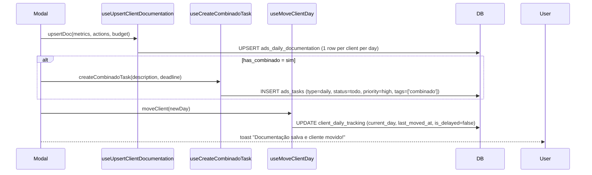

# Ciclo Diário do Ads Manager

> [!abstract] O ritual
> Todo dia útil, cada gestor de ads abre `/ads-manager`, vê seus clientes distribuídos nos dias da semana, e executa: documentar o que fez, registrar combinados (promessas ao cliente viram tasks com prazo), e mover o cliente para o próximo dia. Se não fizer, viram alertas executivos.

Página: `src/pages/AdsManagerPage.tsx:38-52`.

## Seções do Ads Manager (11 abas)

1. **Reuniões** — agenda e presenças
2. **Documentação** — histórico do que foi documentado
3. **Tarefas Diárias** — `ads_tasks` com `task_type='daily'`
4. **Tarefas Semanais** — `task_type='weekly'`
5. **Acompanhamento** — clientes por dia da semana (a aba central do ciclo diário)
6. **Justificativa** — atrasos e explicações
7. **Novo Cliente** — cadastro rápido (mesmo formulário do [[02-Fluxos/Cadastro de Cliente]])
8. **Churns** — clientes em risco
9. **Ferramentas PRO+** — recursos exclusivos
10. **Bônus** — métricas de performance do gestor
11. **Lemas + Onboarding** — operações gerenciais

## Acompanhamento diário (aba central)

Componente: `src/components/ads-manager/AdsAcompanhamentoSection.tsx`.

### O que mostra

Clientes que atendem:
- `status = 'active'`
- `campaign_published_at` NOT NULL (campanha já publicada — onboarding concluído)
- `assigned_ads_manager = {effectiveUserId}` (o gestor atual ou alvo se CEO olhando outro)

Distribuídos em 5 colunas por `client_daily_tracking.current_day`: segunda, terça, quarta, quinta, sexta.

### Ações disponíveis

1. **Documentar**: abre modal, preenche métricas + ações + combinado.
2. **Mover para próximo dia**: drag-drop entre colunas.

### Modal de documentação

Campos:

| Campo | Tipo | Propósito |
|---|---|---|
| `client_budget` | text | Budget atual do cliente |
| `metrics` | text (multiline) | Métricas observadas (CTR, ROAS, impressões, etc.) |
| `actions_done` | text (multiline) | O que foi feito hoje |
| `has_combinado` | radio sim/não | Promessa feita ao cliente? |
| `combinado_description` | text (se sim) | Texto do combinado |
| `combinado_deadline` | date (se sim) | Prazo para entregar |

### Fluxo do submit

### Regras

- **Upsert por (manager, client, date)**: se documentar o mesmo cliente duas vezes no mesmo dia, o segundo append-a no texto (separador `---`).
- **Combinado vira task**: inserção em `ads_tasks` com `tags=['combinado']`, `priority='high'`. Aparece na aba "Tarefas Diárias" do gestor.
- **Mover cliente**: atualiza `current_day`. Não cria histórico de movimentos — é estado corrente.

## Justificativa em tasks (J11)

Quando uma `ads_task` é marcada `done`, se foi criada como combinado (tem `tags=['combinado']`) ou se está overdue, o sistema exige **justificativa J11** via `requireJustification()`.

Gravada em `ads_justifications` e `task_delay_justifications`.

## Clientes em delay

`client_daily_tracking.is_delayed` é um flag calculado. Se o cliente ficou no mesmo dia por mais de 24h úteis, o cron `check_ads_client_stalled_14d()` ou `check_ads_client_no_movement_7d()` marca e dispara notificação.

Ver [[02-Fluxos/Notificações Agendadas]].

## Impacto no dashboard executivo

- **CEO/Gestor Projetos**: pode `effectiveUserId` qualquer gestor e ver o ciclo dele. Tudo é filtrado por `ads_manager_id`.
- **Dashboards agregados**: somam tasks done, combinados cumpridos, docs submetidas por período.

## Rotina típica de um gestor de ads (dia a dia)

> [!example] Um dia real
> 1. 09h — abre `/gestor-ads`
> 2. Vai em "Tarefas Diárias" — ve suas tasks auto-criadas (combinados de ontem + tasks manuais)
> 3. Vai em "Acompanhamento" — vê 5 clientes na coluna "quarta" (hoje)
> 4. Para cada cliente:
>    - Abre modal de documentação
>    - Preenche budget, métricas, ações feitas
>    - Se prometeu algo → marca combinado + data
>    - Move cliente para "quinta"
> 5. Volta em "Tarefas Diárias" — marca como done (com justificativa) os combinados cumpridos
> 6. Ao fim do dia: nenhum cliente ficou na coluna de hoje.

## Outbound análogo

O [[03-Features/Outbound Manager|Outbound Manager]] tem fluxo **quase idêntico** (seções reduzidas, sem Ferramentas PRO+/Bônus/Lemas). Ver [[02-Fluxos/Ciclo Diário do Outbound Manager]] se existir ou considerar este fluxo com pequenas diferenças.

## Links

- [[03-Features/Ads Manager]]
- [[02-Fluxos/Ciclo Semanal]]
- [[02-Fluxos/Geração de Results Report]]
- [[02-Fluxos/Notificações Agendadas]]
