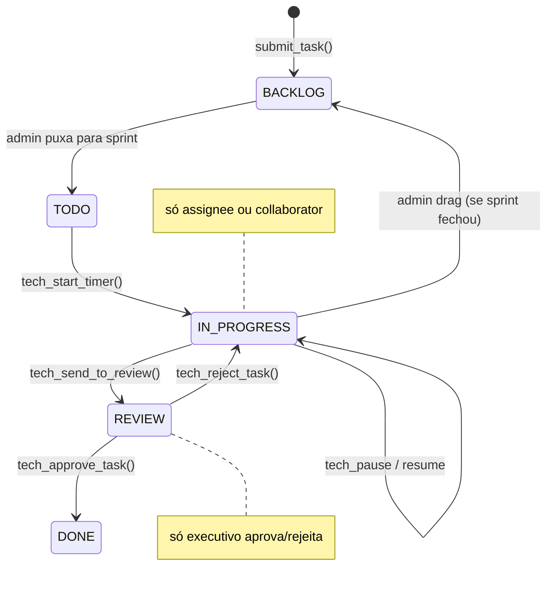

# Ciclo de Tasks Mtech

> [!abstract] Do submit ao done
> Mtech usa um ciclo fechado: BACKLOG → TODO → IN_PROGRESS → REVIEW → DONE. Cada transição é uma RPC `SECURITY DEFINER` — o frontend nunca muda status via UPDATE direto. Isso garante auditoria (activity log), atomicidade (timer stopa junto), e autorização (executivo aprova/rejeita, assignee executa).

Ver [[03-Features/Mtech — Milennials Tech]] para visão geral do módulo.

## Estados (enum `tech_task_status`)

| Estado | Significado |
|---|---|
| `BACKLOG` | Criada, sem sprint atribuído |
| `TODO` | Em sprint ativa, pronta para trabalho |
| `IN_PROGRESS` | Alguém está trabalhando (timer ativo em algum momento) |
| `REVIEW` | Enviada para aprovação executiva |
| `DONE` | Aprovada e concluída |

## Transições permitidas



## Quem pode cada transição

| Transição | RPC | Quem |
|---|---|---|
| (inicial) → BACKLOG | `tech_submit_task()` | qualquer autenticado via `/submit-task` |
| BACKLOG → TODO | (drag direto, RLS + canDragToColumn) | executivo, gestor_projetos |
| TODO → IN_PROGRESS | `tech_start_timer()` | assignee, collaborator, executivo |
| IN_PROGRESS → REVIEW | `tech_send_to_review()` | assignee, collaborator |
| REVIEW → DONE | `tech_approve_task()` | **executivo apenas** |
| REVIEW → IN_PROGRESS | `tech_reject_task()` | **executivo apenas** |
| IN_PROGRESS ↔ blocked | `tech_block_task` / `tech_unblock_task` | assignee, collaborator |

## Submit (entrada)

Rota `/submit-task` — aberta para **qualquer autenticado**, mesmo sem [[01-Papeis-e-Permissoes/Flag can_access_mtech|can_access_mtech]]. Motivo: qualquer pessoa da empresa pode "pedir ajuda técnica" sem precisar acessar o módulo inteiro.

### Form fields

- `title` — obrigatório
- `type` — CHORE / FEATURE / BUG
- `description` — descrição livre
- `acceptance_criteria` — critérios de aceitação
- `technical_context` — contexto técnico (links, docs, issues)
- `priority` — LOW / MEDIUM / HIGH
- `deadline` — opcional
- `tags[]` — opcional
- `attachments[]` — arquivos (upload para bucket `tech-attachments`)

### O que acontece

```
submit_task() RPC insere em tech_tasks:
  status = BACKLOG
  created_by = auth.uid() (IMUTÁVEL — trigger vai rejeitar futuro UPDATE)
  assignee_id = null (admin atribui depois)
  created_at = now()
  updated_at = now()

Depois, UI pode fazer upload de attachments:
  tech_submit_attachment RPC insere em tech_task_attachments
  arquivo vai para bucket tech-attachments
```

## Timer (coração do IN_PROGRESS)

Cada interação com timer vira uma row em `tech_time_entries`:

| Type | Semântica |
|---|---|
| `START` | Começa contagem |
| `PAUSE` | Pausa |
| `RESUME` | Retoma |

**Stop implícito**: `tech_send_to_review()` cria uma entry do tipo PAUSE (ou STOP equivalente) ao mudar para REVIEW.

### Regra de 1 timer ativo por usuário

`tech_start_timer()` e `tech_resume_timer()` **pausam automaticamente** qualquer timer ativo do mesmo usuário em outra task. Isso evita "timer fantasma" onde o dev esqueceu de pausar.

### Cálculo de tempo

Helper `computeTaskTime` em `src/features/milennials-tech/lib/computeTaskTime.ts`. Soma intervalos entre START/RESUME e PAUSE/STOP.

RPC para totais agregados: `tech_get_time_totals(_task_id, _user_id)` — útil para relatórios de horas por pessoa.

## Envio para review

`tech_send_to_review(_task_id)`:
1. Valida `tech_can_edit_task()`.
2. Move `status = REVIEW`.
3. Stopa timer (insere entry PAUSE).
4. Log em `tech_task_activities`.

## Aprovação/rejeição

`tech_approve_task(_task_id)`:
1. Valida `is_executive()` (CEO/CTO).
2. Valida `status = REVIEW`.
3. Move `status = DONE`.
4. Log.

`tech_reject_task(_task_id)`:
1. Mesma validação.
2. Move `status = IN_PROGRESS`.
3. Log (opcional: armazenar reason).

## Block/unblock

Não é um estado separado — é uma flag `is_blocked: boolean` + `blocker_reason: text`.

`tech_block_task(_task_id, _reason)`:
- Valida `tech_can_edit_task()`.
- `_reason` ≤ 1000 chars (enforced na RPC).
- Timer continua ativo se estava (bloqueio não pausa — intencional: "bloqueio externo não é pausa do trabalho").

`tech_unblock_task(_task_id)` — limpa flag e reason.

## Sprint lifecycle (complementar)

Ver [[03-Features/Mtech — Milennials Tech#Sprints]] para detalhes. Resumo:

- `tech_start_sprint()` — PLANNING → ACTIVE. Só pode haver **1 ACTIVE** (unique index).
- `tech_end_sprint()` — ACTIVE → CLOSED. **Move tasks não-DONE de volta para BACKLOG** e limpa `sprint_id`.

## Activity log (`tech_task_activities`)

Toda RPC insere uma row:

- `type` — 'status_change', 'timer_start', 'timer_pause', 'block', 'unblock', 'comment', 'attach'
- `data JSONB` — payload contextual
- `user_id` — quem
- `created_at` — quando

Imutável — append-only. UI em `TaskDetailModal` renderiza como timeline.

## Colaboradores

`tech_task_collaborators` é N:M entre task e users. Um collaborator pode:
- Iniciar/pausar/resumir timer
- Enviar para review
- Bloquear/desbloquear
- Comentar

**Não pode** aprovar (isso é executivo).

## Visualização

- **Backlog tab**: lista todas BACKLOG + TODO, ordenadas por prioridade/deadline
- **Kanban tab**: swim lanes por status
- **Sprints tab**: tasks agrupadas por sprint, com totais de tempo

Cards mostram: título, avatar do creator, avatar do assignee, prioridade, deadline, tags, flag de bloqueio.

## Links

- [[03-Features/Mtech — Milennials Tech]]
- [[01-Papeis-e-Permissoes/Funções RLS#RPCs]]
- [[01-Papeis-e-Permissoes/Flag can_access_mtech]]
