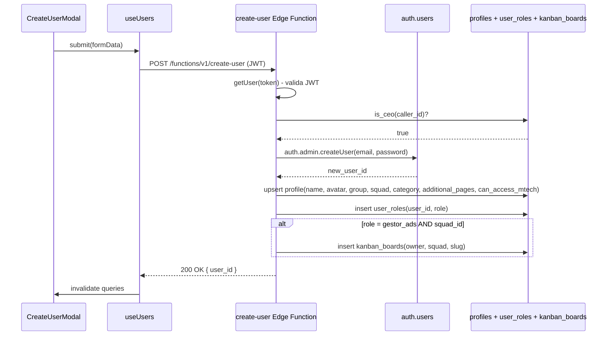

# Criação de Usuário

> [!abstract] Resumo em uma frase
> Só CEO ou CTO criam usuários. O caminho é **sempre** via edge function `create-user` — que orquestra `auth.users` + `profiles` + `user_roles` + (opcional) `kanban_boards`. Três tabelas, uma transação lógica, sem pontas soltas.

## Pré-requisitos

- Chamador precisa estar autenticado e ser **CEO** ou **CTO** (validado via `is_ceo()` no edge).
- Para `role = gestor_ads` com `squad_id`, um board será criado automaticamente (ver abaixo).
- Para qualquer role, o flag `can_access_mtech` pode ser ligado já na criação.

## Caminho feliz



## Componente de UI

`src/components/admin/CreateUserModal.tsx`. Campos do formulário:

| Campo | Obrigatório | Notas |
|---|---|---|
| `name` | ✅ | Nome do perfil |
| `email` | ✅ | Único no `auth.users` |
| `password` | ✅ | Mínimo 6 chars |
| `role` | ✅ | Enum dos [[01-Papeis-e-Permissoes/Papéis do Sistema|17 papéis]] |
| `avatar` | ❌ | URL ou upload (bucket `avatars`) |
| `group_id` | condicional | Necessário para papéis que operam em grupo |
| `squad_id` | condicional | Sub-time dentro do grupo |
| `category_id` | ❌ | Categoria de produto |
| `is_coringa` | ❌ | Flag "curinga" (fora da matriz padrão) |
| `additional_pages[]` | ❌ | Slugs extras liberados além do papel |
| `can_access_mtech` | ❌ | Default false; liga acesso ao [[03-Features/Mtech — Milennials Tech\|Mtech]] |

## Edge function (`supabase/functions/create-user/index.ts`)

### Passo 1 — validar JWT

```ts
const { data: userData, error } = await supabase.auth.getUser(token)
if (error || !userData.user) return 401
```

### Passo 2 — checar permissão

```ts
const { data: isCeo } = await supabase.rpc('is_ceo', { _user_id: userData.user.id })
if (!isCeo) return 403
```

Note: `is_ceo()` agora inclui CTO ([[01-Papeis-e-Permissoes/Hierarquia Executiva|detalhes do fix de abril]]).

### Passo 3 — criar em `auth.users`

```ts
const { data, error } = await supabase.auth.admin.createUser({
  email,
  password,
  email_confirm: true,  // skip e-mail de confirmação
  user_metadata: { name }
})
```

Se email já existe → 409. Se password fraco → 400.

### Passo 4 — upsert em `profiles`

```ts
await supabase.from('profiles').upsert({
  user_id: newUserId,
  name, email, avatar,
  group_id, squad_id, category_id,
  is_coringa, additional_pages,
  can_access_mtech,
})
```

Upsert porque pode existir trigger do Supabase Auth que pré-cria linha vazia em profiles.

### Passo 5 — insert em `user_roles`

```ts
await supabase.from('user_roles').insert({ user_id: newUserId, role })
```

### Passo 6 (opcional) — criar board para `gestor_ads`

Se `role = 'gestor_ads'` E `squad_id` setado:

```ts
await supabase.from('kanban_boards').insert({
  owner_user_id: newUserId,
  squad_id,
  slug: `gestor-ads-${name_slug}`,
  name: `Ads — ${name}`,
  created_by: caller_id,
})
```

Isso garante que, ao entrar no `/gestor-ads`, o novo usuário já tem um board para operar.

## Efeitos colaterais imediatos

### O novo usuário pode logar

JWT é gerado na primeira chamada a `signInWithPassword`. Profile e role já estão em lugar antes disso.

### O sidebar já mostra o que precisa

`AuthContext` faz um único SELECT em `profiles` + `user_roles` no login. As flags derivadas (`isCEO`, `canViewTabById`, etc.) são calculadas no cliente.

### Flag de Mtech entra em vigor

Se `can_access_mtech = true`, `can_see_tech()` retorna true → SELECT em `tech_*` passa → sidebar mostra Mtech → rotas `/mtech/*` acessíveis.

### Kanban board aparece

Se `gestor_ads + squad_id`, o board criado na step 6 aparece no `/gestor-ads` e pode ser acessado por colegas via RLS `can_view_board()`.

## Tasks que "sobem pra alguém" na criação

> [!info] A resposta direta à pergunta
> Criar um usuário **não gera tasks automaticamente para terceiros**. O usuário entra "limpo": nenhum onboarding é aberto, nenhum alerta é disparado a CEO ou gestores.
>
> **O que acontece automaticamente:**
> - `profiles` preenchido
> - `user_roles` setado
> - (opcional) `kanban_boards` criado para gestor_ads
>
> **O que NÃO acontece:**
> - Nenhum `system_notifications` é inserido
> - Nenhum e-mail de boas-vindas
> - Nenhuma task em `tech_tasks`, `ads_tasks`, `onboarding_tasks`
>
> Tasks para o usuário novo surgem apenas quando:
> - Ele é **atribuído** a clientes (aí `ads_tasks` semanais via [[02-Fluxos/Ciclo Semanal]] começam a aparecer para ele)
> - Ele é **atribuído como assignee** em tech_tasks ou kanban_cards
> - Se é `gestor_ads`, as tasks semanais automáticas de terça começam a ser criadas para ele via `create-weekly-tasks`

## Erros comuns

| Erro | Causa | Fix |
|---|---|---|
| 401 | JWT expirado | Re-login |
| 403 | Chamador não é CEO/CTO | Só executivo cria usuário |
| 400 "missing required fields" | Faltou name/email/password/role | Validar no frontend |
| 500 na etapa de auth | email duplicado | Checar `auth.users` antes, ou mostrar erro melhor |
| 500 na etapa de profile | Race com trigger Supabase | Upsert resolve |
| 500 "foreign key group_id" | Group deletado antes do submit | Re-fetch da lista de groups |

## Testando localmente

```bash
# 1. rodar Supabase local
supabase start

# 2. Bootstrap do primeiro CEO (ambiente novo)
# Configure .env.scripts com SUPABASE_SERVICE_ROLE_KEY primeiro
node scripts/create-ceo-user.mjs

# 3. login como CEO no frontend, criar usuário via UI
npm run dev
```

## Delete correspondente

Para remover: ver [[02-Fluxos/Exclusão de Usuário]]. Não faça DELETE manual no Studio — quebra 31 FKs.

## Links

- [[01-Papeis-e-Permissoes/Papéis do Sistema]]
- [[01-Papeis-e-Permissoes/Hierarquia Executiva]]
- [[01-Papeis-e-Permissoes/Flag can_access_mtech]]
- [[04-Integracoes/Edge Functions]]
- [[02-Fluxos/Exclusão de Usuário]]
- [[05-Operacoes/Scripts]]
