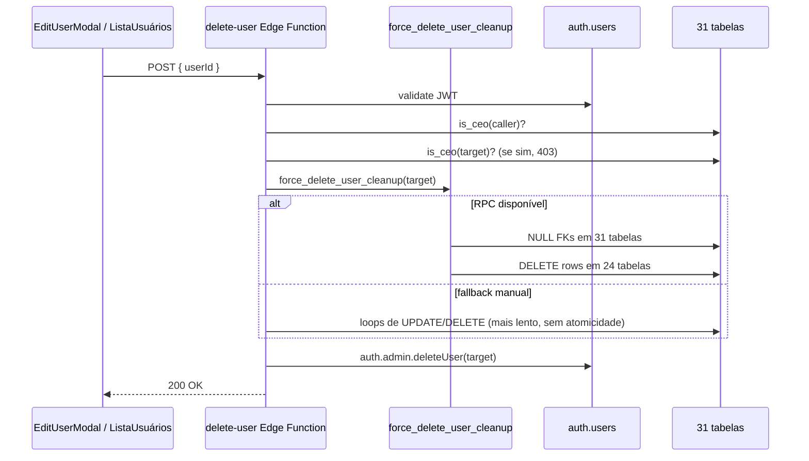

# Exclusão de Usuário

> [!danger] Operação pesada, irreversível
> Deletar usuário envolve limpeza em **~31 tabelas** via cascade manual (NULL-ificar FKs) + DELETE em mais 24 tabelas + `auth.admin.deleteUser()`. Tudo em uma única edge function (`delete-user`), idealmente transacional via RPC `force_delete_user_cleanup`.
>
> **Nunca** delete usuário direto no Supabase Studio. FKs ficam órfãs, logs quebram, e o sistema entra em estado inconsistente.

## Pré-requisitos

- Chamador autenticado.
- Chamador é **CEO ou CTO** (via `is_ceo()`).
- Target **não pode ser CEO** — há uma proteção "last man standing": mesmo outro CEO não deleta CEO. (CTO pode ser deletado por outro CEO.)

## Fluxo



## O que é limpo

### Tabelas com FK NULL-ificada (preservam histórico)

~31 tabelas onde o usuário deletado era referenciado mas cujos dados devem ficar:

- `kanban_boards.owner_user_id, created_by`
- `kanban_cards.assigned_to, created_by`
- `tech_tasks.assignee_id, created_by`
- `tech_time_entries.user_id` (note: `tech_tasks.created_by` é imutável por trigger — NULL requer manipulação especial ou SKIP)
- `clients.assigned_ads_manager, assigned_comercial, assigned_crm, assigned_rh, assigned_outbound_manager, assigned_mktplace, created_by`
- `onboarding_tasks.assigned_to`
- `ads_tasks.ads_manager_id` (se a task sobrevive ao delete)
- `comercial_tracking.user_id`, `comercial_daily_documentation.user_id`
- `cs_insights.user_id`, `cs_contact_history.user_id`
- `system_notifications.user_id`
- `trainings.created_by`
- ...

Objetivo: auditoria sobrevive ao delete. Ver "quem fez o que em março" deve continuar possível.

### Tabelas com DELETE em cascata (não fazem sentido sem o usuário)

~24 tabelas onde as rows são 100% pessoais:

- `user_roles` (CASCADE nativo)
- `profiles` (CASCADE nativo)
- `card_comments.user_id` — comentários do usuário
- `card_activities.user_id` — ações do usuário
- `tech_task_activities.user_id`
- `cs_contact_history` do próprio usuário
- `notifications*` do usuário (leitura)
- `ads_note_notifications.user_id`
- `churn_notification_dismissals.user_id`
- `task_delay_notifications.user_id`, `task_delay_justifications.user_id`
- `meetings_one_on_one.user_id`
- `weekly_problems.user_id`
- ...

### `auth.users`

Último passo: `auth.admin.deleteUser(user_id)`. Isso invalida todos os JWTs do usuário.

## Fallback manual (se RPC falhar)

Se `force_delete_user_cleanup()` não existir ou falhar, o edge loop-a manualmente:

```ts
// pseudo
for (const table of TABLES_TO_NULL) {
  for (const col of table.cols) {
    await supabase.from(table.name).update({ [col]: null }).eq(col, userId)
  }
}
for (const table of TABLES_TO_DELETE) {
  await supabase.from(table).delete().eq(table.userCol, userId)
}
await supabase.auth.admin.deleteUser(userId)
```

Arquivo: `supabase/functions/delete-user/index.ts:69-150`.

> [!warning] Atomicidade
> O fallback manual **não é atômico** — se falhar no meio, o usuário fica parcialmente deletado. Por isso preferimos a RPC `force_delete_user_cleanup` que roda tudo em uma transação Postgres.

## Casos especiais

### Deletar gestor_ads com board

O `kanban_boards` dele tem `owner_user_id` setado. O cleanup NULL-ifica o owner. O board fica "órfão" — continua acessível via RLS por `squad_id`, mas sem dono. Admin pode reatribuir ou deletar o board depois.

### Deletar gestor atribuído a clientes

`clients.assigned_ads_manager` vira NULL para todos os clientes daquele gestor. Esses clientes ficam **sem gestor atribuído** e deixam de aparecer em qualquer dashboard até reatribuição. **É decisão de negócio**: antes de deletar, reatribuir os clientes.

### Deletar CEO

**Bloqueado**. O edge checa `is_ceo(target)` e retorna 403. Motivo: se o último CEO se deleta, ninguém mais pode criar/deletar usuários.

Para deletar CEO intencionalmente (caso de uso legítimo: sair da empresa, outro CEO assumir), o caminho é:
1. Criar o novo CEO.
2. Rebaixar o CEO antigo via UPDATE manual em `user_roles` (troca role para `gestor_projetos`, por exemplo).
3. Deletar o agora ex-CEO.

### Deletar usuário que tem tasks Mtech em aberto

`tech_tasks.assignee_id` vira NULL. As tasks ficam "desatribuídas" no Backlog/Kanban. Admin deve reatribuir antes de fechar o sprint.

`tech_tasks.created_by` é **imutável por trigger**. A limpeza precisa fazer um exception path (SKIP ou usar `SECURITY DEFINER` que disable trigger). Ver `force_delete_user_cleanup` para o workaround.

## Erros comuns

| Erro | Causa |
|---|---|
| 403 "target is CEO" | Tentativa de deletar um CEO |
| 500 "foreign key violation" | Nova tabela com FK não-listada no cleanup — atualizar a RPC |
| 500 "cannot update immutable column created_by" | Trigger de imutabilidade bloqueando NULL-ificação — usar SKIP ou SECURITY DEFINER elevation |
| 500 "auth.admin.deleteUser failed" | Se foi até aqui, limpeza do Postgres já ocorreu — usuário fica em estado inválido; recriar manualmente via SQL |

## Checklist antes de deletar

> [!todo]
> - [ ] Reatribuir todos os clientes desse usuário (se é gestor)
> - [ ] Fechar ou reatribuir tasks Mtech em aberto
> - [ ] Se é `gestor_ads`, decidir destino do kanban board
> - [ ] Comunicar o time (notificações em tabelas do próprio usuário serão limpas)
> - [ ] **Confirmar que é CEO/CTO fazendo a ação** (não tem como outro papel fazer)
> - [ ] Considerar desativação (em vez de delete) se auditoria futura pode precisar

## Alternativa: desativar em vez de deletar

Não há flag `is_active` em `profiles` atualmente. Se precisar "usuário que não entra mais mas dados ficam":

1. UPDATE password em `auth.users` (via `auth.admin.updateUserById`) para algo aleatório.
2. Revogar sessões ativas.
3. Mover para grupo "inativos" se existir.

Considerar adicionar `profiles.is_active` no futuro se esse caso for frequente.

## Links

- [[02-Fluxos/Criação de Usuário]]
- [[01-Papeis-e-Permissoes/Hierarquia Executiva]]
- [[04-Integracoes/Edge Functions]]
