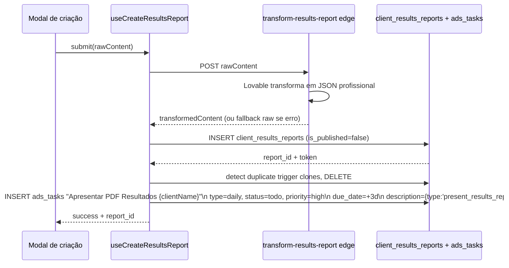

# Geração de Results Report

> [!abstract] O ciclo de 30 dias
> A cada 30 dias (contando a partir do `campaign_published_at` ou `2026-04-02` para clientes antigos), o gestor gera um "Results Report" — relatório de apresentação. O sistema usa AI (Lovable) para refinar o texto, gera um link público com token, e cria auto-task "Apresentar PDF" com prazo de 3 dias.

Hooks: `src/hooks/useClientResultsReports.ts`.

## Status do ciclo

Calculado por `useResultsReportStatus(clientId)`:

| Status | Condição |
|---|---|
| `pending` | Sem contrato assinado ainda (onboarding não concluiu marco 5) |
| `normal` | ≤ 26 dias desde último ciclo |
| `alert` | 27-30 dias |
| `overdue` | ≥ 30 dias |

**Cutoff date para "clientes antigos"**: `2026-04-02`. Clientes cujo contrato foi assinado **antes** dessa data têm `cycle_start_date` = cutoff. Clientes novos têm `cycle_start_date` = data de assinatura.

Regra existe porque o sistema passou a funcionar com esse ciclo a partir de abril/2026 — clientes pré-existentes não são penalizados com "todos overdue desde o início".

## Campos do relatório

Em `client_results_reports`:

- `client_id`
- `created_by`
- `actions_last_30_days` — texto livre
- `achievements` — conquistas do período
- `traffic_results` — métricas de tráfego
- `key_metrics` — KPIs-chave
- `top_campaign` — campanha destaque
- `improvement_points` — pontos de melhoria
- `next_30_days` — plano para próximos 30d
- `next_steps` — próximos passos imediatos
- `client_logo_url`
- `sectionImages` — JSONB com imagens por seção
- `is_published` — se já foi publicado (link público ativo)
- `pdf_url` — URL do PDF se gerado
- `cycle_start_date`, `cycle_end_date`
- `token` — UUID para acesso público

## Fluxo de criação



## Transformação AI

Edge function `supabase/functions/transform-results-report/index.ts` chama o Lovable AI com payload:

```json
{
  "clientName": "...",
  "actionsLast30Days": "...",
  "achievements": "...",
  "trafficResults": "...",
  "keyMetrics": "...",
  "topCampaign": "...",
  "improvementPoints": "...",
  "next30Days": "...",
  "nextSteps": "..."
}
```

Retorna JSON estruturado e polido. Se a API falhar, o hook usa o raw content como fallback — o relatório é criado de qualquer jeito.

## Trigger de duplicata

Há um trigger no DB que, em certos cenários, duplica o INSERT. O hook detecta isso (`allDuplicates` na code) e deleta os clones em lotes de 50. Bug conhecido — a fix ideal seria remover o trigger, mas há dependências.

## Auto-task "Apresentar PDF"

Inserida em `ads_tasks`:

- `ads_manager_id` = gestor atribuído ao cliente
- `title` = "Apresentar PDF Resultados {clientName}"
- `description` = JSON `{type: 'present_results_report', reportId, clientId}` — permite UI abrir o report direto ao clicar
- `task_type` = 'daily'
- `status` = 'todo'
- `priority` = 'high'
- `due_date` = +3 dias

Quando o gestor marcar essa task como done, é pedida **justificativa J11** (`requireJustification()`).

## Publicação

Quando `is_published = true`, o relatório fica acessível em:

```
/results/{token}
```

Renderizado por `src/pages/PublicResultsReportPage.tsx`. Sem auth — só o token.

## Visualização pelo cliente

A página pública mostra:
- Logo do cliente (`client_logo_url`)
- Seções do relatório com imagens
- Marcos alcançados
- Métricas em gráficos (Recharts)
- Próximos passos
- Opção de download PDF (se `pdf_url` setado)

## Impacto nas notificações

- `ads_tasks` "Apresentar PDF" overdue → `check_pending_ads_documentation()` ou similar dispara notificação.
- Cliente sem report em 35 dias → bug vem em algum check de stalled.

## Links

- [[03-Features/Results Reports]]
- [[03-Features/Ads Manager]]
- [[04-Integracoes/Lovable AI]]
- [[02-Fluxos/Notificações Agendadas]]
