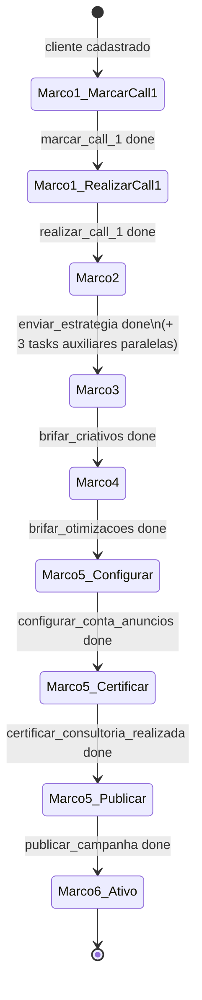
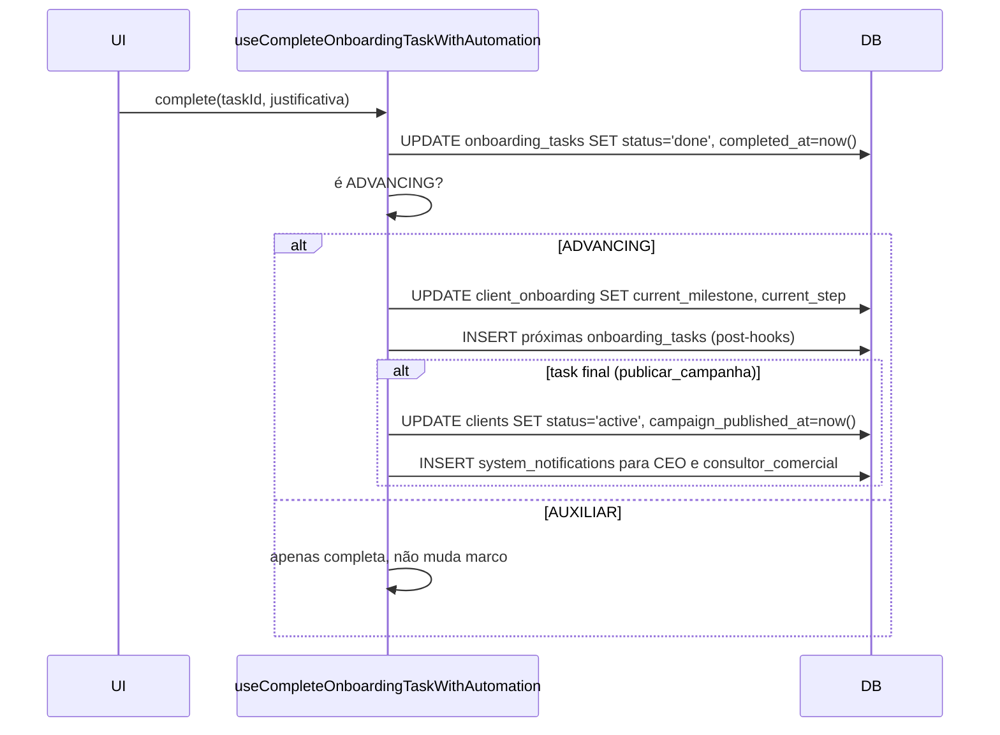

# Onboarding de Cliente

> [!abstract] O motor
> Onboarding é uma **máquina de estados** com 6 marcos. Completar uma task "avançadora" (advancing) dispara automaticamente: avanço de marco, criação da(s) próxima(s) task(s), e — no fim — marca o cliente como `active` e notifica CEO + consultor_comercial.

Implementação central: `src/hooks/useOnboardingAutomation.ts`.

## Os 6 marcos

| Marco | Rótulo | Objetivo |
|---|---|---|
| 1 | Call 1 | Primeira conversa com o cliente |
| 2 | Estratégia | Enviar estratégia aprovada |
| 3 | Criativos | Briefar criativos |
| 4 | Otimizações | Briefar otimizações |
| 5 | Configuração + publicação | Conta de anúncios + certificação + **publicar campanha** |
| 6 | Acompanhamento | Cliente ativo — entra no ciclo diário |

`client_onboarding.current_milestone` (1..6) + `current_step` (slug da task atual).

## Tasks avançadoras (ADVANCING_TASK_DEFINITIONS)

Definidas em `src/hooks/useOnboardingAutomation.ts:24-113`. Apenas essas **avançam** o onboarding:

| Task | Marco | Due days | Próximo step | Próximo marco | Auto-cria |
|---|---|---|---|---|---|
| `marcar_call_1` | 1 | +1 | call_1_marcada | 1 | `call_1_realizada` |
| `realizar_call_1` | 1 | +2 | criar_estrategia | 2 | POST_CALL_1_TASKS |
| `enviar_estrategia` | 2 | +3 | brifar_criativos | 3 | POST_ESTRATEGIA_TASKS (4 paralelas) |
| `brifar_criativos` | 3 | +3 | elencar_otimizacoes | 4 | POST_BRIFAR_CRIATIVOS_TASKS |
| `brifar_otimizacoes` | 4 | +3 | configurar_conta_anuncios | 5 | POST_BRIFAR_OTIMIZACOES_TASKS |
| `configurar_conta_anuncios` | 5 | +2 | certificar_consultoria | 5 | POST_CONFIGURAR_CONTA_TASKS |
| `certificar_consultoria_realizada` | 5 | +2 | esperando_criativos | 5 | POST_CERTIFICAR_CONSULTORIA_TASKS |
| `publicar_campanha` | 5 | +3 | acompanhamento | 6 | (fim) — marca cliente como active |

Outras tasks (auxiliares, como `anexar_link_consultoria`, `enviar_link_drive`) **completam** mas não avançam marco. Elas existem para auditoria e checklist operacional.

## Máquina de estados



## O que acontece ao completar uma task



## Justificativas (J8, J10)

Quando completar um marco, o sistema pede **justificativa** em certas transições:

- **J8 — Milestone Concluído**: ao completar qualquer task avançadora (marco passa de N para N+1).
- **J10 — Skip de marco**: se um admin completa uma task fora de ordem (ex.: pula do marco 2 pro 4), o sistema detecta e exige justificativa extra.

Armazenadas em tabelas de justificativa específicas (`ads_justifications`, `task_delay_justifications`, ou similar). Auditoria preservada.

## Atribuição de tasks

Cada `onboarding_tasks.assigned_to` é populado seguindo a regra em `useCreateInitialOnboardingTask`:

```
client.assigned_ads_manager → se setado
├── senão: effectiveUserId (usuário visualizado no contexto)
└── senão: user.id (logado)
```

Ou seja: tasks de onboarding **seguem o ads_manager atribuído**. Se reatribuir o gestor do cliente, tasks já criadas **não** são reatribuídas automaticamente — precisa fazer isso explicitamente.

## Tabelas envolvidas

| Tabela | Papel |
|---|---|
| `client_onboarding` | estado do cliente: `current_milestone`, `current_step`, `milestone_N_started_at`, `completed_at` |
| `onboarding_tasks` | tasks individuais: `task_type`, `status`, `due_date`, `milestone`, `assigned_to`, `completed_at`, `justification` |
| `clients` | ao final: `status=active`, `campaign_published_at=now()` |

## Visão na UI

- **Lista de onboarding**: `/clientes` ou similar — mostra cliente, marco atual, task pendente, overdue flags.
- **Badge**: cliente em onboarding aparece com badge diferenciado nos kanbans e dashboards.
- **CS Dashboard**: `sucesso_cliente` vê todos os clientes em onboarding ativo.

## Integração com notificações

- Tasks que passam de **overdue** disparam `task_delay_notifications` via cron `check_onboarding_tasks_stuck()`.
- Onboarding parado há mais de X dias dispara `check_stalled_onboarding()`.

Ver [[02-Fluxos/Notificações Agendadas]].

## Erros e recuperações

| Cenário | Comportamento |
|---|---|
| Completar task de onboarding que não existe | Frontend não deixa (botão só aparece para task em `onboarding_tasks`) |
| Dois admins completam a mesma task simultaneamente | Segunda mutação no-op (idempotente) |
| Cliente já está marco 6 e alguém tenta reabrir | UPDATE manual via admin — não há fluxo |
| Task avançadora completa mas cliente não avança | Bug em `useCompleteOnboardingTaskWithAutomation` — checar se task_type está em ADVANCING_TASK_DEFINITIONS |

## Links

- [[02-Fluxos/Cadastro de Cliente]]
- [[03-Features/Clientes]]
- [[03-Features/Ads Manager]]
- [[02-Fluxos/Notificações Agendadas]]
