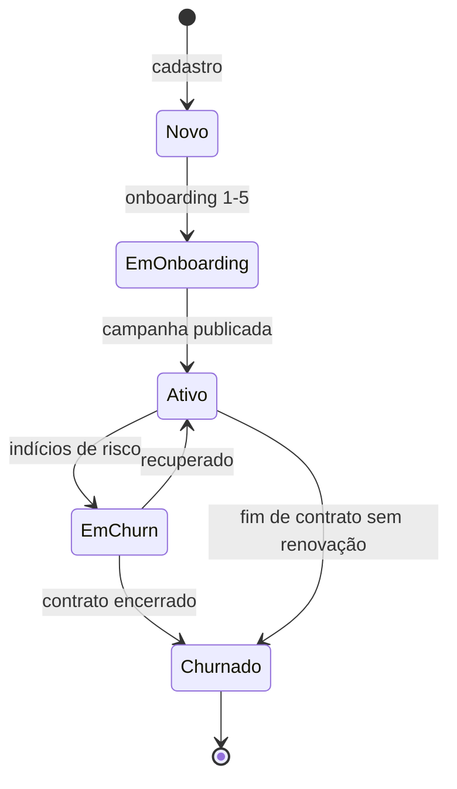

# Clientes

> [!abstract] A entidade central do produto
> Toda rotina do sistema gira em torno de clientes. Cadastrar, onboardar, atribuir gestores, acompanhar diário/semanal, gerar relatórios, classificar, renovar ou churnar. Esta nota dá o mapa — detalhes de cada fluxo ficam em notas dedicadas.

Tabela principal: `clients`.

## Campos críticos

### Identidade
- `id`, `name`, `razao_social`, `cnpj`, `cpf`, `niche`, `general_info`

### Financeiro
- `expected_investment`, `monthly_value`, `sales_percentage`
- `entry_date`, `contract_duration_months`, `payment_due_day`
- `contracted_products[]`, `torque_crm_products[]`

### Assignments (gestores)
- `assigned_ads_manager` — gestor de anúncios
- `assigned_comercial` — consultor comercial
- `assigned_crm` — gestor CRM (Torque)
- `assigned_rh` — RH
- `assigned_outbound_manager` — outbound (opcional)
- `assigned_mktplace` — consultor marketplace

### Status
- `status` — `new` → `active` → `inactive` / `churned`
- `comercial_status` — fase comercial
- `comercial_entered_at` — início do ciclo comercial
- `campaign_published_at` — marco de publicação (fim do [[02-Fluxos/Onboarding de Cliente|onboarding]])

### Label
- `client_label` — `otimo` | `bom` | `medio` | `ruim` | `null`

## Ciclo de vida

## Client label

Setado via `ClientLabelSelector` (admin ou sucesso_cliente).

| Label | Visual | Significado |
|---|---|---|
| `otimo` | Star / success | Cliente excepcional |
| `bom` | ThumbsUp / info | Cliente saudável |
| `medio` | Minus / warning | Atenção |
| `ruim` | ThumbsDown / destructive | Intervenção urgente |
| `null` | — | Não classificado |

Triggers: quando sobe para `otimo` ou `bom`, hook `useUpdateClientLabel` auto-completa planos pendentes relacionados (`plansToComplete`).

## Filtros por gestor

Cada dashboard (Ads Manager, Outbound Manager, Sucesso Cliente, Consultor Comercial, Marketplace) filtra `clients` por um `assigned_*`. O mesmo cliente pode aparecer em múltiplos dashboards (se tem múltiplos gestores).

## Quem pode editar

| Ação | Quem |
|---|---|
| Ver cliente | executivo, gestor_projetos, qualquer gestor atribuído |
| Editar info | executivo, gestor_projetos, sucesso_cliente (e gestor_ads via UI específica) |
| Reatribuir | executivo, gestor_projetos |
| Deletar | executivo (via cascata administrada) |
| Setar label | executivo, gestor_projetos, sucesso_cliente |

## Integrações

- **[[04-Integracoes/API REST v1]]**: cria cliente via M2M (sem assignments, humano aloca depois)
- **Torque CRM**: produtos em `torque_crm_products[]`, integração via `assigned_crm` e API Torque

## Tabelas relacionadas

- `client_product_values` — valor por produto contratado
- `client_onboarding` — estado do onboarding
- `client_daily_tracking` — posição no ciclo diário (Ads Manager)
- `client_results_reports` — [[03-Features/Results Reports|relatórios de 30 dias]]
- `financeiro_client_onboarding` / `financeiro_active_clients` — lado financeiro
- `churn_notifications` — alertas de risco

## Fluxos relacionados

- [[02-Fluxos/Cadastro de Cliente]]
- [[02-Fluxos/Onboarding de Cliente]]
- [[02-Fluxos/Ciclo Diário do Ads Manager]]
- [[02-Fluxos/Geração de Results Report]]

## Links

- [[00-Arquitetura/Modelo de Dados#6. Clientes]]
- [[03-Features/Ads Manager]]
- [[03-Features/Outbound Manager]]
