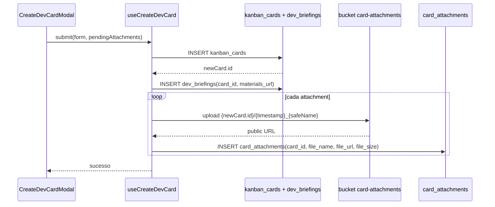

# Kanban Devs

> [!abstract] Onde as demandas de dev chegam (não é Mtech)
> Kanban de área para demandas de desenvolvimento **vindas de outras áreas** (ex.: gestor de ads pede uma landing page). Fluxo leve, com swim lane por dev e status por card. Contraste com [[03-Features/Mtech — Milennials Tech|Mtech]], que é o backlog/sprint do próprio time de engenharia.

Componente: `src/components/devs/DevsKanbanBoard.tsx`.

## Rota

`/devs` — visível para `devs` (próprios), `ceo`, `cto`, `gestor_projetos`, `gestor_ads`, `sucesso_cliente`, `design` (integração).

## Colunas

Dinâmicas, uma por dev do squad. Nome: `BY {NOME}` e `JUSTIFICATIVA ({NOME})`.

Gerenciadas via sync effect que compara `devs` array com `kanban_columns`.

## Status do card

Enum interno (campo `status` de `kanban_cards`):

| Status | Significado |
|---|---|
| `a_fazer` | criado, aguardando início |
| `fazendo` | em execução |
| `alteracao` | retornado para ajustes |
| `aguardando_aprovacao` | pronto para review |
| `aprovados` | concluído |

## Quem pode mover

`DEV_CARD_MOVERS`: `ceo`, `cto`, `gestor_projetos`, `gestor_ads`, `devs`, `sucesso_cliente`.

## Criação (CreateDevCardModal)

Componente: `src/components/kanban/CreateDevCardModal.tsx`.

Campos:
- `title`, `description` (obrigatórios)
- `priority` (normal / urgent)
- `due_date` (obrigatório)
- `column_id` (escolher dev destino)
- `attachments[]` (diferencial deste kanban)
- Briefing: `materials_url`

## Fluxo de upload de anexos

- Nome do arquivo é sanitizado via `sanitizeFileName()`.
- Path: `{newCard.id}/{Date.now()}_{safeName}` — colisão virtualmente impossível.
- Se um upload individual falhar, o loop continua — outros anexos não são abortados.

## Notificações

Ao mover card para `aguardando_aprovacao`:

- `useCreateDevCompletionNotification()` é chamado
- INSERT em `dev_completion_notifications`:
  - `requester_id` = criador do card
  - `completed_by` = quem moveu
  - `card_id`, `card_title`
- O requester recebe notificação no [[03-Features/Notification Center]]

## Aprovação

Mover `aguardando_aprovacao` → `aprovados` conclui. Não há notificação de aprovação adicional (o requester já foi avisado no passo anterior).

## Integração com Design

O board de Devs é **visível ao time de design**. Motivo: muitas tasks de dev dependem de assets criados pelo design. Os designers entram como consultoria em cards do Devs Board.

## Arquivamento

Cards marcados como arquivados (`archived=true`) não aparecem no board padrão. Função `canArchiveDevCard()` controla quem pode arquivar.

## Anti-patterns a evitar

> [!danger] NÃO FAZER
> - **Criar task técnica de backlog aqui.** Se é trabalho interno do time de dev (refactor, nova feature do produto), vai para [[03-Features/Mtech — Milennials Tech|Mtech]]. Devs Board é para demandas **cross-área**.
> - **Mover status pelo DB direto.** O board não loga em `card_activities` se o UPDATE não passa pelo hook.

## Links

- [[03-Features/Kanbans por Área]]
- [[03-Features/Mtech — Milennials Tech]]
- [[03-Features/Notification Center]]
- [[04-Integracoes/Storage Buckets]]
