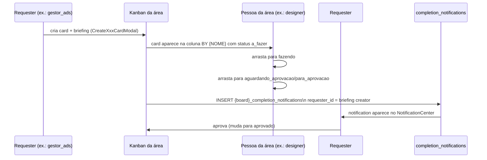

# Kanbans por Área

> [!abstract] Swim lanes por pessoa, não por status
> Cada área produtiva (Design, Devs, Video, Atrizes, Produtora) tem um kanban **cuja coluna é um usuário da área**, não um status. A coluna se chama `BY {NOME}` — cards dentro dela são o que aquela pessoa tem. Status vive no card (`a_fazer`, `fazendo`, `para_aprovacao`, etc.).
>
> Contraste com [[03-Features/Mtech — Milennials Tech|Mtech]], que usa status fixo em coluna.

## Boards existentes

| Área | Componente | Role primário | Status típicos |
|---|---|---|---|
| [[03-Features/Kanban Devs\|Devs]] | `src/components/devs/DevsKanbanBoard.tsx` | `devs` | a_fazer → fazendo → alteracao → aguardando_aprovacao → aprovados |
| [[03-Features/Kanban Design\|Design]] | `src/components/design/DesignKanbanBoard.tsx` | `design` | a_fazer → fazendo → arrumar → para_aprovacao → aprovado |
| [[03-Features/Kanban Video\|Video]] | `src/components/video/VideoKanbanBoard.tsx` | `editor_video` | idem Devs |
| [[03-Features/Kanban Atrizes\|Atrizes]] | `src/components/atrizes/AtrizesKanbanBoard.tsx` | `atrizes_gravacao` | idem Devs |
| [[03-Features/Kanban Produtora\|Produtora]] | `src/components/produtora/ProdutoraKanbanBoard.tsx` | `produtora` | próprio |
| [[03-Features/RH Jornada Equipe\|RH Jornada]] | `src/components/rh/RHJornadaEquipeKanban.tsx` | `rh` | stages da jornada (onboarding, integração, desenvolvimento, promoção, datas, desligamento) |

## Infraestrutura compartilhada

### Tabelas

| Tabela | Papel |
|---|---|
| `kanban_boards` | um board por squad/área. `slug UNIQUE`, `owner_user_id`, `squad_id` |
| `kanban_columns` | colunas do board. Nos kanbans por área, representam pessoas: `BY {NOME}` ou `JUSTIFICATIVA ({NOME})` |
| `kanban_cards` | cards. `card_type` diferencia área (design/dev/video/atrizes/produtora); `status` string por board; `column_id`, `assigned_to`, `created_by`, `priority`, `progress`, `due_date`, `tags[]` |
| `card_comments` | threads |
| `card_activities` | log append-only |
| `card_attachments` | metadados; bytes no bucket `card-attachments` |

### Briefings específicos

Cada board tem sua tabela de briefing (informação inicial do pedido):

| Board | Tabela briefing | Campos típicos |
|---|---|---|
| Design | `design_briefings` | references_url, identity_url, client_instagram, script_url |
| Devs | `dev_briefings` | materials_url |
| Atrizes | `atrizes_briefings` | client_instagram, script_url, drive_upload_url |
| Video | `video_briefings` | idem design |
| Produtora | `produtora_briefings` | idem |

### Notificações por área

Cada board tem tabela própria de completion notifications:

- `design_completion_notifications`
- `dev_completion_notifications`
- `video_completion_notifications`
- `atrizes_completion_notifications`
- `produtora_completion_notifications`

Schema idêntico: `id`, `card_id`, `card_title`, `completed_by`, `completed_by_name`, `requester_id`, `requester_name`, `created_at`, `read`, `read_at`.

**Disparadas quando** um card entra na coluna de aprovação (`aguardando_aprovacao` ou `para_aprovacao`). Destinatário: o criador do briefing.

Lidas em: [[03-Features/Notification Center]].

## Padrão de permissão (`canMove{Board}Card`)

Cada board define em `src/hooks/use{Board}Kanban.ts` um array `{BOARD}_CARD_MOVERS` com roles autorizados. Padrão universal:

```ts
const MOVERS = [
  'ceo', 'cto',          // executivos
  'gestor_projetos',     // admin
  'gestor_ads',          // gestor da rota
  'sucesso_cliente',     // visibilidade cruzada
  '{role da área}',      // os donos
]
```

Exceção: RH Jornada é restritíssimo — apenas `ceo`, `cto`, `gestor_projetos`.

## Fluxo típico de card



## Upload de anexos (só Devs)

Devs é o único board (atualmente) com upload de arquivos. No `CreateDevCardModal`, o usuário anexa arquivos; ao criar card, os arquivos vão para bucket `card-attachments` com path `{card_id}/{timestamp}_{safe_filename}`.

Ver [[03-Features/Kanban Devs]] para detalhes do fluxo de upload.

## Colunas dinâmicas (sync com usuários)

Cada board tem um effect que sincroniza colunas com a lista de usuários da área. Se um designer novo é criado e atribuído ao squad de design, uma nova coluna `BY {NOME}` é criada. Se sai, a coluna pode ser arquivada.

> [!warning] Race condition conhecida
> A sync **só roda se a lista de usuários carregou**. Em todos os boards há um guard:
> ```ts
> if (designers.length === 0) return  // "skip sync - no users loaded yet"
> ```
> Sem isso, ao abrir o board antes do fetch concluir, o sync apagaria todas as colunas.

## Create modals por área

| Board | Modal |
|---|---|
| Design | `CreateDesignCardModal` |
| Devs | `CreateDevCardModal` |
| Video | `CreateVideoCardModal` |
| Atrizes | `CreateAtrizesCardModal` |
| Produtora | `CreateProdutoraCardModal` |

Todos seguem o mesmo padrão: título, descrição, prioridade, due date, coluna destino (= pessoa), briefing específico.

## Links

- [[03-Features/Kanban Devs]]
- [[03-Features/Kanban Design]]
- [[03-Features/Kanban Atrizes]]
- [[03-Features/Kanban Video]]
- [[03-Features/Kanban Produtora]]
- [[03-Features/RH Jornada Equipe]]
- [[03-Features/Notification Center]]
