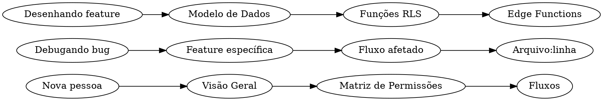

# Milennials Growth — Wiki do Sistema

> [!abstract] Para que serve esta wiki
> Documentação viva do sistema. Escrita no espírito de Andrej Karpathy: primeiro os princípios, depois o código. Cada ação dentro do produto — criar um usuário, mover um card, publicar uma campanha, completar uma task — tem aqui uma resposta precisa sobre **o que acontece**, **onde acontece** (arquivo:linha), **quem pode disparar**, e **qual é o efeito colateral**.
>
> Se você está perdido, comece por [[00-Arquitetura/Visão Geral]]. Se quer entender permissões, vá direto para [[01-Papeis-e-Permissoes/Matriz de Permissões]]. Se precisa debugar um fluxo específico, abra [[02-Fluxos]].

## Como ler esta wiki

1. **Primeiros princípios primeiro.** Antes de abrir um arquivo, entenda o domínio. `/mtech` não faz sentido sem saber o que é um sprint no contexto da empresa.
2. **Links são a espinha.** Tudo aqui é `[[wikilink]]`. Se uma nota cita outra, há um link — caso contrário, falha de documentação.
3. **Código é a verdade.** Toda afirmação tem referência `arquivo:linha`. Se a wiki diverge do código, o código ganha — abra um PR para atualizar a wiki.

## Mapa de Conteúdo

### 00 — Arquitetura
Os alicerces. Entenda isto antes de mexer em qualquer coisa.

- [[00-Arquitetura/Visão Geral|Visão Geral]] — o que o sistema é, o que não é
- [[00-Arquitetura/Stack Técnica|Stack Técnica]] — frontend, backend, infra
- [[00-Arquitetura/Supabase e RLS|Supabase e RLS]] — modelo de segurança
- [[00-Arquitetura/Modelo de Dados|Modelo de Dados]] — tabelas por domínio
- [[00-Arquitetura/Realtime e Polling|Realtime e Polling]] — como a UI fica fresh

### 01 — Papéis e Permissões
Quem pode fazer o quê, e por quê.

- [[01-Papeis-e-Permissoes/Papéis do Sistema|Papéis do Sistema]] — os 17 papéis e para que servem
- [[01-Papeis-e-Permissoes/Matriz de Permissões|Matriz de Permissões]] — a tabela canônica
- [[01-Papeis-e-Permissoes/Hierarquia Executiva|Hierarquia Executiva]] — CEO, CTO, o fix de abril
- [[01-Papeis-e-Permissoes/Flag can_access_mtech|Flag can_access_mtech]] — acesso por usuário ao Mtech
- [[01-Papeis-e-Permissoes/Funções RLS|Funções RLS]] — `is_ceo`, `is_executive`, `can_view_user`, `can_see_tech`

### 02 — Fluxos
Cenários ponta-a-ponta. Cada fluxo é um caso de uso real do produto.

- [[02-Fluxos/Criação de Usuário|Criação de Usuário]] — da edge function ao sidebar
- [[02-Fluxos/Exclusão de Usuário|Exclusão de Usuário]] — o cleanup de 31 tabelas
- [[02-Fluxos/Cadastro de Cliente|Cadastro de Cliente]] — validação, assignments, limites de gestor
- [[02-Fluxos/Onboarding de Cliente|Onboarding de Cliente]] — os 6 marcos, 11 tasks que avançam
- [[02-Fluxos/Ciclo Diário do Ads Manager|Ciclo Diário do Ads Manager]] — documentação, combinados, movimentação de dia
- [[02-Fluxos/Ciclo Semanal|Ciclo Semanal]] — criação automática de tasks de terça
- [[02-Fluxos/Ciclo de Tasks Mtech|Ciclo de Tasks Mtech]] — submit → backlog → review → done
- [[02-Fluxos/Geração de Results Report|Geração de Results Report]] — o relatório de 30 dias
- [[02-Fluxos/Notificações Agendadas|Notificações Agendadas]] — as 23 RPCs de alerta

### 03 — Features
Detalhamento por módulo/tela. Aqui mora o "como".

- [[03-Features/Mtech — Milennials Tech|Mtech (Milennials Tech)]]
- [[03-Features/Kanbans por Área|Kanbans por Área]] — overview dos 7 boards
  - [[03-Features/Kanban Devs|Kanban Devs]]
  - [[03-Features/Kanban Design|Kanban Design]]
  - [[03-Features/Kanban Atrizes|Kanban Atrizes]]
  - [[03-Features/Kanban Produtora|Kanban Produtora]]
  - [[03-Features/Kanban Video|Kanban Video]]
  - [[03-Features/RH Jornada Equipe|RH Jornada Equipe]]
- [[03-Features/Ads Manager|Ads Manager]]
- [[03-Features/Outbound Manager|Outbound Manager]]
- [[03-Features/Clientes|Clientes]]
- [[03-Features/Results Reports|Results Reports]]
- [[03-Features/Upsells|Upsells]]
- [[03-Features/Públicas — NPS, Diagnóstico, Strategy|Públicas (NPS, Diagnóstico, Strategy)]]
- [[03-Features/Trainings e Pro Tools|Trainings e Pro Tools]]
- [[03-Features/Groups, Squads e Custom Roles|Groups, Squads e Custom Roles]]
- [[03-Features/Notification Center|Notification Center]]

### 04 — Integrações
O sistema fala com o mundo.

- [[04-Integracoes/Edge Functions|Edge Functions]] — inventário completo
- [[04-Integracoes/API REST v1|API REST v1]] — M2M para CRM externo
- [[04-Integracoes/Vercel e CSP|Vercel e CSP]] — hospedagem do frontend
- [[04-Integracoes/Storage Buckets|Storage Buckets]] — anexos, avatares
- [[04-Integracoes/Lovable AI|Lovable AI]] — transformação de relatórios

### 05 — Operações
Como deployar, testar, debugar.

- [[05-Operacoes/Deploy|Deploy]] — frontend (Vercel) + edge functions (Supabase)
- [[05-Operacoes/Migrations|Migrations]] — convenção, ordem, rollback
- [[05-Operacoes/Scripts|Scripts]] — `create-ceo-user`, `create-cto-user`, deploy automation
- [[05-Operacoes/Testes|Testes]] — vitest, playwright, pgTAP
- [[05-Operacoes/Segredos e Env|Segredos e Env]] — `.env`, `.env.scripts`, edge secrets

## Convenções de notação

- **Referências de código**: `src/hooks/useAdsManager.ts:264`
- **Tabelas de DB**: `clients`, `tech_tasks`, `ads_daily_documentation` — em code span
- **Rotas**: `/mtech/kanban`, `/ads-manager` — sempre com barra inicial
- **RPCs**: `is_ceo(uuid)`, `tech_start_timer(uuid)` — em code span com assinatura
- **Callouts** são usados para: `info` (contexto), `warning` (pegadinha conhecida), `danger` (NÃO FAZER), `question` (decisão em aberto)

## O que esta wiki NÃO é

- **Não é um changelog.** Para ver "o que mudou", use `git log`.
- **Não é o PRD.** O produto mora no código e nas conversas com o fundador.
- **Não é estática.** Cada migration, cada feature nova deve atualizar a nota relevante. PR que mexe em fluxo sem tocar a wiki é PR incompleto.

## Gaps conhecidos

> [!question] A preencher
> - Documentação dos fluxos de Financeiro (`financeiro_*` tables)
> - Diagrama C4 nível 2 da arquitetura
> - Runbook de incidentes (ex.: "CTO não vê clientes" — o incidente 2026-04-16)
> - SLOs e alertas
